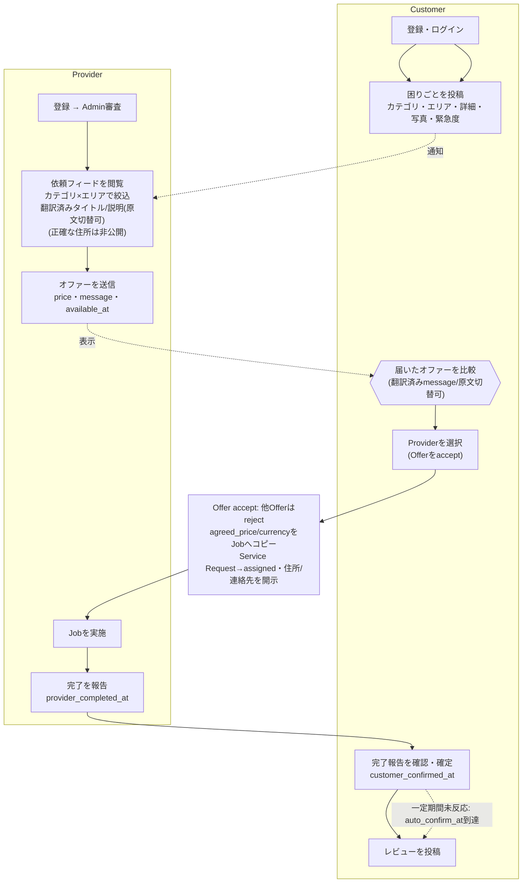
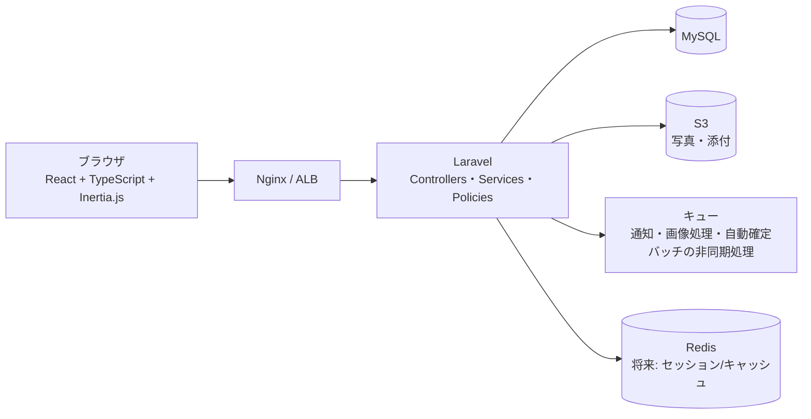
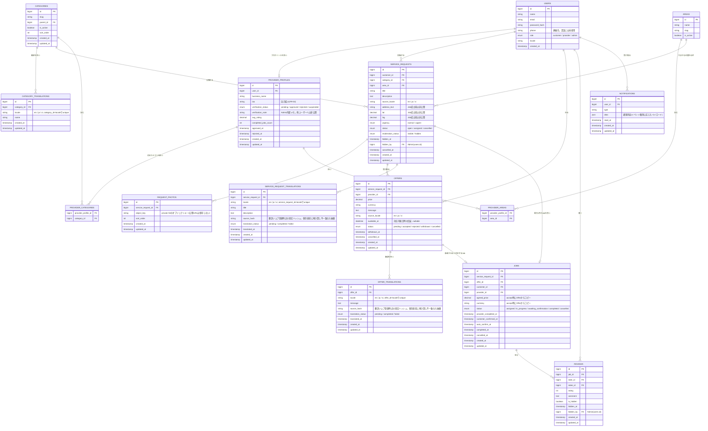
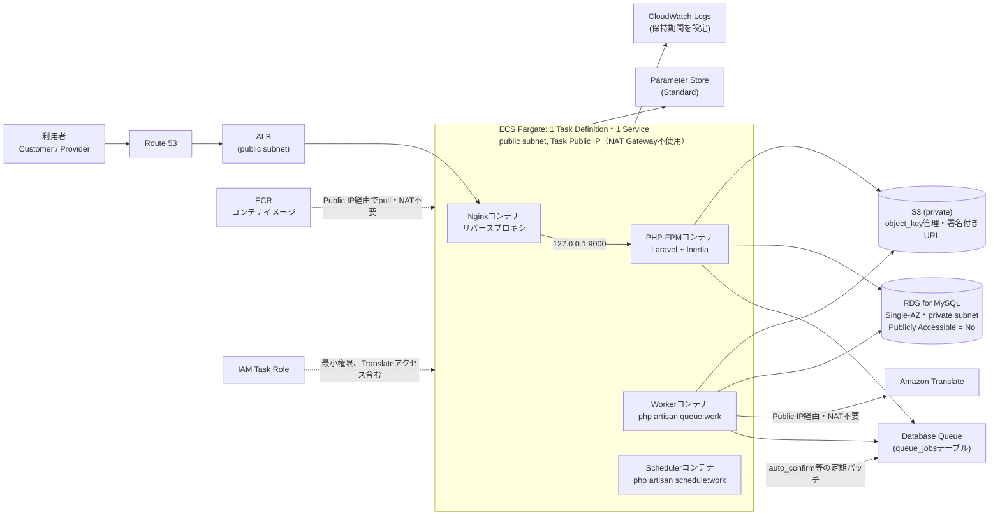

# Da Nang Help — 要件定義・技術設計ドラフト

**Draft v0.3.1 — Implementation Ready — 2026-08-30**（Draft v0.3: 2026-08-30 からの改訂）
ダナン在住外国人と現地ローカルサービス提供者をつなぐマッチングプラットフォーム — 要件定義・技術設計ドラフト

> 非公開ドキュメント / アプリケーションコード・Laravel/React/Docker等のセットアップは本ドラフトの時点では未着手。Draft v0.3.1では、Phase 1〜Phase 5相当（開発環境構築〜オファー機能）の実装に着手できるレベルまで要件・データベース・API設計の整合性を取り、基本設計を一旦freezeします。ただしJobキャンセルの詳細条件など一部の論点は[20 未確定事項](#20-未確定事項確認したいこと)としてPhase 6着手前に確定する前提です。

## 変更履歴

### Draft v0.3.1 追加改訂（AWSコストレビュー、バージョン番号は維持）

MVPがまだ利用者・収益の存在しない実験段階であることを踏まえ、AWS費用を最小化する観点でStage 1構成を再設計しました。個人情報保護・認可・データ整合性は一切削減していません。

1. Stage 1のECS構成を、Web Task／Queue Worker Taskの2タスク常時稼働から、**単一Fargate Task内のWeb／Worker／Scheduler 3コンテナ**（1 Service, desired count 1）へ統合し、常時稼働リソースを最小化 → [18](#18-aws構成案)
2. Stage 1では**NAT Gatewayを使用しない**方針を明記。ECS TaskはpublicサブネットへPublic IP付きで配置し、Security Groupでインバウンドを制限。大量の有料VPC Endpointによる代替も採用しない → [18](#18-aws構成案)
3. **ALBはStage 1から維持**する方針を明確化（EC2への切り替えは行わず、ECS/Fargate/ALB学習を優先） → [18](#18-aws構成案)
4. 翻訳結果の非同期処理における競合対策として、`service_request_translations`/`offer_translations`に`source_hash`カラムを追加し、古い翻訳ジョブが新しい翻訳結果を上書きしないルールを明記（FR-23a） → [09](#09-機能要件) / [16](#16-データベース--er設計案)
5. `source_locale`の仕様を確定：投稿・送信時点のUI表示言語を初期値とし、投稿前に変更可能。自動言語判定サービスは使用しない → [09](#09-機能要件)
6. 「Service Requestあたり最大1つの有効Job」という表現を、UNIQUE制約の実態に合わせて「Service Requestあたり通算最大1件のJob」に統一（非機能要件・技術アーキテクチャ・ER図の注記） → [10](#10-非機能要件) / [15](#15-技術アーキテクチャ案) / [16](#16-データベース--er設計案)
7. Queue／Schedulerの実行方式（`queue_jobs`へのテーブル名変更、`failed_jobs`のプルーニング、冪等な自動確定バッチ、`onOneServer`+database lockの将来方針）を明記 → [18](#18-aws構成案)
8. Amazon Translateの費用制御策（文字数上限、レート制限、AWS Budgets予算アラート）を明記。予算アラートは支出の自動停止ではないことを明示 → [18](#18-aws構成案)
9. 非機能要件に「コスト管理（Stage 1）」を新設し、費用削減のために省略しない項目（認証・認可、private S3、EXIF削除、トランザクション・行ロック、制約、秘密情報管理、RDSバックアップ、最低限のログ、IAM最小権限）を明記 → [10](#10-非機能要件)
10.（軽微な修正）単一Fargate Task内の「Webコンテナ」を、Nginxコンテナ・PHP-FPMコンテナの2コンテナに分離（Task構成は3コンテナから4コンテナへ）。ALBのターゲットはNginxのみとし、PHP-FPMへは`127.0.0.1`経由でのみアクセス可能とした。Phase 1の実装開始を妨げるものではなく、Phase 10（AWSデプロイ）までに反映すればよい表現上の修正 → [18](#18-aws構成案)

### Draft v0.3.1(Implementation Ready)の変更点

1. Service Request(`title`/`description`)とOffer(`message`)に機械翻訳を追加。原文を必ず保持し、翻訳が未完了・失敗の場合は原文へフォールバックする。翻訳結果は`service_request_translations`/`offer_translations`へ保存して再利用する → [09](#09-機能要件) / [15](#15-技術アーキテクチャ案) / [16](#16-データベース--er設計案)
2. `GET /requests/{id}`の閲覧権限とレスポンス項目を明確化。承認済みかつカテゴリ・エリア条件を満たすProviderのみ閲覧可とし、正確な住所・座標・連絡先はアサインされたProviderにのみサーバー側で制御して返却する（フロントエンドで隠すだけの実装は禁止） → [15](#15-技術アーキテクチャ案) / [17](#17-api設計案)
3. ER図に不足していたタイムスタンプ・モデレーション関連カラム等を追加し、`provider_profiles`/`reviews`/`service_requests`/`offers`/`jobs`/`request_photos`/`notifications`のスキーマを実装可能なレベルへ精緻化。`request_photos.s3_url`は`object_key`へ変更し、S3をprivate運用に統一 → [16](#16-データベース--er設計案)
4. UNIQUE・CHECK制約、外部キー削除方針、Offerの編集・withdraw・accept後の変更禁止ルール、Adminの編集権限の範囲（本文・価格・評価値の直接改変禁止）を明記 → [16](#16-データベース--er設計案) / [09](#09-機能要件)
5. 画像プライバシー対策（EXIF削除・再エンコード・MIME検証・private S3・期限付きURL）を非機能要件・技術アーキテクチャへ追加
6. AWS Stage 1にQueue Worker・Scheduler・Amazon Translateを追加し、Web／Queue Worker／Schedulerの責務を明確化（その後のコストレビューにより単一Task内3コンテナ構成へ統合、下記「追加改訂」参照） → [18](#18-aws構成案)
7. RoadmapのPhase 4・5・8へ機械翻訳の実装順序を反映し、Phase 0の現在地表記をDraft v0.3.1に更新。冒頭の説明文をロードマップと整合する表現に修正 → [19](#19-開発ロードマップ)
8. Job自動確定日数・Jobキャンセル条件等、Phase 6関連の未確定事項は今回も確定せず維持 → [20](#20-未確定事項確認したいこと)

### Draft v0.3(Implementation Ready)の変更点

1. `jobs`に`agreed_price`・`currency`を追加し、Offer accept時にacceptされたOfferの価格をJobへスナップショットコピーする設計を追加。Job生成後にOffer側の情報が変わってもJobの合意内容は変化しない → [09](#09-機能要件) / [16](#16-データベース--er設計案)
2. `offers`に`message`(TEXT)・`available_at`(DATETIME, nullable)を追加し、機能要件とER図の不整合を解消 → [16](#16-データベース--er設計案)
3. Service RequestとJobのstatus責務を分離。`service_requests.status`は`open` / `assigned` / `cancelled`の3値のみとし、Job生成後の進行状況(`in_progress` / `awaiting_confirmation` / `completed`)は`jobs.status`のみをSingle Source of Truthとする → [09](#09-機能要件) / [16](#16-データベース--er設計案)
4. MVPの認証方式をEmail + Passwordに確定。電話番号は連絡先情報としてのみ保存し、SMS OTP・電話番号認証・Social Login(Google/Apple等)はMVP対象外(将来拡張候補)とする → [09](#09-機能要件) / [08](#08-スコープ外機能mvp対象外)
5. Jobキャンセルの条件・ペナルティ・Service Request再オープンの要否・`auto_confirm_at`までの具体的日数は今回は確定せず、Phase 6実装前に別途決定する項目として維持する。現行のER・Status設計はこれらの将来決定を妨げないことを確認済み → [20](#20-未確定事項確認したいこと)
6. 本ドラフトをDraft v0.3(Implementation Ready)と位置付け、Phase 1〜Phase 5相当の基本設計を一旦freezeする

### Draft v0.2 変更履歴サマリー(参考)

1. Service Requestのステータスから `offered` を削除し、`open / assigned / in_progress / completed / cancelled` に簡素化。Offerの有無は `offers` テーブルの存在で判定する設計に変更 → [09](#09-機能要件) / [16](#16-データベース--er設計案)
2. Service Requestのキャンセル条件を「Offerが0件の場合のみ」から「Customerが**Offerをacceptするまで**」に変更し、キャンセル時に未確定Offerを無効化するルールを追加 → [09](#09-機能要件)
3. Categoryの多言語対応を `categories` + `category_translations` のtranslation table方式に変更（JSONカラムは不採用） → [16](#16-データベース--er設計案)
4. Providerの対応エリアを1対1(district)からMany-to-Many(`areas` / `provider_areas`)に変更し、依頼フィードをカテゴリ×エリアで絞込む設計に更新 → [16](#16-データベース--er設計案)
5. open状態の依頼フィードでは正確な住所・座標・連絡先をProviderに公開せず、Job成立後に選ばれたProviderのみへ開示するプライバシー方針を追加 → [10](#10-非機能要件)
6. Offer accept処理をDBトランザクション・行ロックで整合性担保し、Service Requestあたり最大1Jobを保証する設計を明記（Service/Action層の方針も追加） → [15](#15-技術アーキテクチャ案)
7. Job完了フローを「Provider完了報告 → Customer完了確認 → 自動確定」の3段階に分離し、`provider_completed_at` 等をJobに追加 → [16](#16-データベース--er設計案)
8. AWS Stage 1の構成にALBを組み込み、CloudFront / SQS / Auto ScalingはStage 2以降に整理 → [18](#18-aws構成案)
9. 初期ローンチのGo-to-market戦略として「限定エリア・限定カテゴリからの立ち上げ」を明記 → [12](#12-戦略的考察)
10. 検証すべきProduct Hypotheses（H1〜H4）と参考指標を新設 → [13](#13-product-hypotheses)
11. 未確定事項のうち8論点（対応言語・決済・審査体制・チャット・対象エリア・収益化・Admin運用・初期ターゲット国籍）をMVPの暫定方針として確定 → [20](#20-未確定事項確認したいこと)
12. 開発環境方針（Docker中心、Node.js LTS固定）を明文化 → [15](#15-技術アーキテクチャ案)
13. 上記の追加はデータ整合性・プライバシー・将来拡張性・仮説検証・AWS構成の是正が目的であり、MVPの機能数は増やしていない → [08](#08-スコープ外機能mvp対象外)

## 目次

1. [プロダクトビジョン](#01-プロダクトビジョン)
2. [課題設定](#02-課題設定)
3. [想定ユーザー](#03-想定ユーザー)
4. [ユーザーペルソナ](#04-ユーザーペルソナ)
5. [コアユーザージャーニー](#05-コアユーザージャーニー)
6. [ユーザーストーリー](#06-ユーザーストーリー)
7. [MVP機能](#07-mvp機能)
8. [スコープ外機能（MVP対象外）](#08-スコープ外機能mvp対象外)
9. [機能要件](#09-機能要件)
10. [非機能要件](#10-非機能要件)
11. [収益モデルの候補](#11-収益モデルの候補)
12. [戦略的考察](#12-戦略的考察)
13. [Product Hypotheses](#13-product-hypotheses)
14. [将来的な拡張機能](#14-将来的な拡張機能)
15. [技術アーキテクチャ案](#15-技術アーキテクチャ案)
16. [データベース / ER設計案](#16-データベース--er設計案)
17. [API設計案](#17-api設計案)
18. [AWS構成案](#18-aws構成案)
19. [開発ロードマップ](#19-開発ロードマップ)
20. [未確定事項・確認したいこと](#20-未確定事項確認したいこと)

---

## 01 プロダクトビジョン

> ダナンで暮らす外国人にとって、生活の困りごとを言葉の壁なく相談できる「もう一人の、頼れる現地の友人」になる。

現在、ダナン在住の外国人が水漏れやエアコン故障、鍵の紛失といった生活トラブルに直面したとき、頼れる先は駐在員向けFacebookグループへの投稿や、知人からの紹介にほぼ限られています。Da Nang Helpは、①困りごとをカテゴリ・写真・位置情報付きで構造化して投稿する、②複数のローカル事業者から見積もり（オファー）を集めて比較する、③レビューによって信頼を可視化して蓄積する — この3つの仕組みを通じて、この非効率と不安を解消します。

目指すのは単発の便利ツールではなく、ダナンという一つの都市に深く根ざし、外国人の生活の質と、ローカル事業者の収益機会の両方を底上げする「暮らしのインフラ」としての地位です。（v0.2でも本ビジョンに変更はありません）

---

## 02 課題設定

### Customer側の課題

- **言語の壁** — ベトナム語での価格交渉や依頼内容の説明ができず、依頼そのものを諦めてしまう。
- **価格の不透明性** — 「外国人価格」でぼったくられているのではという不安が常につきまとい、相場観を持てない。
- **探索コストの高さ** — 信頼できる業者を探す手段が、非構造化なFacebookグループの投稿や運任せの口コミに限られる。
- **緊急時の対応遅れ** — 水漏れや鍵の紛失など即応が必要な場面で、すぐ頼める先が見つからない。
- **記録が残らない** — やり取りが口頭やチャットに散在し、後からのトラブルの根拠として使えない。

### Provider側の課題

- **外国人顧客へのリーチ手段の欠如** — 言語・チャネルの制約から、単価の高い外国人需要にほぼアクセスできていない。
- **信頼構築コストの高さ** — 初対面の外国人との取引は、言語や商習慣の違いから敬遠されがちで営業しづらい。
- **非効率な受注導線** — Zaloや口コミ頼みの単発対応で、実績や評判が「資産」として蓄積されない。
- **トラブル負担の偏り** — 依頼内容の伝達ミスによる手戻りやクレームのリスクを、一方的に負いやすい。

このセクションで述べている内容の一部は、まだ検証されていない仮説を含みます。検証すべき仮説として明示的に整理したものは [13 Product Hypotheses](#13-product-hypotheses) を参照してください。

---

## 03 想定ユーザー

### Customer — ダナン在住の外国人

| セグメント | 特徴 | 主なニーズ |
|---|---|---|
| 日本人駐在員・帯同家族 | ベトナム語・英語ともに不安があるケースが多く、会社のサポート外の生活面は自力対応が必要 | 安心して任せられること、丁寧な対応 |
| 欧米系デジタルノマド・移住者 | 英語は堪能だがベトナム語は不可、短中期滞在でコスパとスピードを重視 | 価格の透明性、即時対応 |
| 韓国人ロングステイ・リタイア層 | 生活基盤の構築段階にあり、信頼性と丁寧な対応を重視 | 長期的に付き合える業者との関係構築 |
| その他外国人（欧州・オセアニア・他アジア圏など） | 言語背景は多様だが「ベトナム語ができない」点は共通 | 多言語対応、シンプルなUI |

初期ユーザー獲得の中心は日本人および英語話者としますが、プロダクト自体は特定国籍限定にはしません（詳細は[20 未確定事項](#20-未確定事項確認したいこと)）。

### Provider — ダナンのローカルサービス提供者

| カテゴリ | 具体例 | 特徴 |
|---|---|---|
| インフラ・設備修理系 | エアコン修理, 水道修理, 電気工事, インターネット関連 | 緊急依頼が多く、即応力が評価に直結する |
| 生活支援系 | 掃除, 洗濯機修理, 引っ越し | 定期需要があり、見積もり比較が起きやすい |
| 出張・緊急対応系 | バイク修理, 鍵屋 | 場所と時間の制約が強く、位置情報の精度が重要 |
| チーム型事業者 | 複数名体制の便利屋・工事業者 | 高単価・大型案件に対応でき、実績の可視化に積極的 |

---

## 04 ユーザーペルソナ

### Customer

**田中さん（仮）— 32歳・日本人駐在員・滞在1年目**
- 背景: IT企業のダナン拠点勤務。ベトナム語不可、英語は業務レベル。生活面は会社のサポート外で自力対応が必要。
- 課題: 部屋のエアコンが動かず、業者探しから価格交渉まで一人でやる自信がない。
- 求めるもの: 日本語または丁寧な英語で完結する依頼フロー、価格の妥当性が分かる比較。
- 声: 「壊れたときに、まず何をすればいいか分からないのが一番のストレス」

**Ethanさん（仮）— 27歳・欧米系デジタルノマド・滞在半年**
- 背景: リモートワーカー。英語は流暢、ベトナム語は挨拶程度。
- 課題: Wi-Fiの調子が悪くリモートワークに支障が出ているが、すぐ直せる業者が見つからない。
- 求めるもの: レビューで実力が分かる業者、チャットで直接やり取りできる手軽さ。
- 声: 「口コミで聞くだけで半日つぶれるのが非効率」

**ミンジュンさん（仮）— 58歳・韓国人ロングステイ・滞在2年目**
- 背景: 退職後にダナンへ移住。英語は片言、ベトナム語も専門的な交渉は難しい。
- 課題: 洗濯機の故障修理で業者と金額交渉がうまくいかず、高額請求された経験がある。
- 求めるもの: 事前に価格が分かる見積もり比較、写真で依頼内容を正確に伝えられること。
- 声: 「金額の話になると急に不利になる気がしていた」

### Provider

**フォンさん（仮）— 38歳・個人のエアコン修理業者・営業10年**
- 背景: ダナン市内で個人営業。ベトナム語のみ。スマホは日常的に使うが、英語UIのアプリには不安がある。
- 動機: 外国人客は単価が高く、良い評判が広まれば安定した収入源になると感じている。
- 懸念: 言語の壁で依頼内容を誤解し、トラブルになるのではという不安。

**レさん（仮）— 45歳・引っ越し／便利屋チーム経営者**
- 背景: スタッフ4名を抱える小規模事業者。既存の受注はZaloと口コミが中心。対応エリアは複数区にまたがる。
- 動機: 実績とレビューを可視化できれば、単発の値引き合戦から抜け出し、正当な価格で継続的に受注したい。
- 懸念: 登録・審査の手間、外国人とのコミュニケーションコスト。

---

## 05 コアユーザージャーニー

依頼の投稿から選択までを「オファー制」にすることで、価格交渉の言語負担をCustomerからProviderへのオファー送信という非同期の行為に置き換え、口頭での値段交渉が最大の不安要因になっているという課題（[02 課題設定](#02-課題設定)）を構造的に解消します。

Offer acceptのタイミングでService Requestは`assigned`となり、以降の作業進捗（対応開始・完了報告・完了確認・完了）はService Requestではなく**Jobのstatus**のみで管理されます（詳細は[16 データベース / ER設計案](#16-データベース--er設計案)の「ステータス遷移」参照）。また、acceptされたOfferの価格はその時点でJobの`agreed_price`/`currency`としてスナップショットコピーされ、以降Offer側の情報が変わってもJobの合意内容は変わりません。

アサイン確定のタイミングで初めて正確な住所・座標と連絡先が選ばれたProviderにのみ開示されるため、それまでにProviderへ渡る情報はエリア・カテゴリ・写真・説明・緊急度に限定されます（詳細は[10 非機能要件](#10-非機能要件)）。Job完了は「Providerの完了報告」と「Customerの完了確認（または一定期間経過後の自動確定）」の2段階を経て確定し、その後のレビューが次の依頼者の判断材料として蓄積されます（詳細は[09 機能要件](#09-機能要件)）。

---

## 06 ユーザーストーリー

### Customer

- 困りごとをカテゴリ・エリア・写真・位置情報付きで投稿し、業者に正確に内容を伝えたい。
- 複数のProviderからのオファーを価格・評価とあわせて比較し、納得して選びたい。
- 選んだProviderの過去のレビューと完了実績を見て、安心して依頼したい。
- Offerをacceptするまでは依頼を取り下げられるようにしたい。
- 依頼（Service Request）がassignedになった後は、Jobの進行状況（対応中・完了報告あり・完了）を確認したい。
- Providerからの完了報告を確認し、問題なければ完了を確定したい。
- 完了後にレビューを残し、次に困ったときの判断材料を積み上げたい。
- 自分の言語（日本語・英語など）でストレスなく操作したい。
- 自分が入力した言語のまま投稿しても、Providerには自動翻訳された内容が伝わるようにしたい（翻訳の正確性が保証されないことは理解した上で使いたい）。

### Provider

- 自分の対応カテゴリ・対応エリア（複数）に合った依頼だけをフィードで確認したい。
- 依頼フィードの時点では正確な住所が分からなくても、大まかな位置(エリア)で対応可否を判断したい。
- 外国語で書かれた依頼内容でも、自動翻訳で自分の言語の概要を理解し、必要なら原文も確認したい。
- 依頼内容を見て、価格と対応可能日を提示するオファーを送りたい。
- 選ばれた依頼についてCustomerの連絡先と正確な住所を確認し、対応を進めたい。
- 作業が終わったら完了報告を行い、Customerの確認をもってJobを終えたい。
- 完了後のレビューを蓄積し、プロフィールとして実績を示したい。
- Admin審査を通過して、プラットフォーム上で「登録済み」であることを示したい。

### Admin

- 新規登録したProviderの情報を確認し、承認・却下を判断したい。
- 不適切な投稿やレビューを非表示にし、プラットフォームの健全性を保ちたい。
- カテゴリ・エリアの一覧を追加・編集し、実際の需要に合わせて整理したい。
- CustomerとProvider間のトラブル報告を確認し、必要に応じて介入したい。
- 全体の依頼数・成約率・レビュー傾向を把握し、意思決定に活かしたい。

---

## 07 MVP機能

| モジュール | 機能 | 概要 | 優先度 |
|---|---|---|---|
| 認証・ユーザー | 会員登録・ログイン | Customer / Provider それぞれの登録・ログイン（Email + Password）。電話番号は連絡先情報として保存し、認証には使用しない | MUST |
| 認証・ユーザー | 言語設定 | UI表示言語の切替（日本語・英語・ベトナム語） | MUST |
| 認証・ユーザー | Providerプロフィール | 屋号・自己紹介の登録 | MUST |
| カテゴリ | 多言語カテゴリ管理 | `categories` + `category_translations` によるカテゴリ名の日本語・英語・ベトナム語登録 | MUST |
| エリア | エリアマスタ管理 | Adminによるエリア（area）の追加・編集・非表示 | MUST |
| エリア | Provider対応エリア（複数） | Providerが対応カテゴリ・対応エリアを複数選択して登録 | MUST |
| 困りごと投稿 | 依頼作成 | カテゴリ・エリア選択・詳細・写真（複数枚、EXIF削除・再エンコード済み）・正確な位置情報（非公開項目として保存）・緊急度・入力言語（source_locale）の選択 | MUST |
| 困りごと投稿 | 依頼フィード（Provider向け） | 承認済みかつカテゴリ×エリアが合致するProviderにのみ表示。翻訳済み／原文切替可のタイトル・説明。正確な住所・座標・Customer連絡先は非表示 | MUST |
| 困りごと投稿 | 依頼詳細の認可 | 投稿者・Admin・条件を満たす承認済みProviderのみ閲覧可。正確な住所・連絡先はアサイン後、選ばれたProviderにのみ開示 | MUST |
| 困りごと投稿 | 依頼キャンセル | Offerをacceptするまでの間、Customerが依頼を取り下げ可能（未確定Offerは無効化） | SHOULD |
| 機械翻訳 | 依頼の自動翻訳 | Service Requestのtitle/descriptionをen/ja/viへ非同期機械翻訳。原文を保持し、未完了・失敗時は原文にフォールバック | MUST |
| 機械翻訳 | Offerの自動翻訳 | Offerのmessageをen/ja/viへ非同期機械翻訳 | MUST |
| 機械翻訳 | 原文/翻訳の切替表示 | 「自動翻訳」であることを明示し、原文と翻訳を切り替えて確認できる | MUST |
| オファー | オファー送信 | Providerがprice・currency・message・available_at（対応可能日時の目安、任意）を提示 | MUST |
| オファー | オファー比較 | Customerが受け取ったオファーを一覧比較（messageは翻訳済み／原文切替可） | MUST |
| オファー | オファー編集・取り下げ | pendingのOfferのみProviderが編集・withdraw可能 | MUST |
| オファー | オファー承諾（accept） | Offer accept・他Offer却下・Service Requestのassigned化・agreed_price/currencyのJobへのコピー・Job生成をトランザクションで一括処理 | MUST |
| Job管理 | Job開始 | Providerが対応開始を報告（in_progress） | MUST |
| Job管理 | 連絡先・正確な位置情報の開示 | アサイン確定後、選ばれたProviderとCustomerの間でのみ電話番号・正確な住所を相互開示 | MUST |
| Job管理 | 完了報告（Provider） | Providerが作業完了を報告（provider_completed_at） | MUST |
| Job管理 | 完了確認（Customer）／自動確定 | Customerの確認（customer_confirmed_at）、または一定期間後の自動確定（auto_confirm_at） | MUST |
| レビュー | レビュー投稿 | 評価（星）＋コメント、Job完了後に投稿 | MUST |
| レビュー | プロフィール上の実績表示 | 平均評価・完了件数の表示（非表示化されたレビューは平均評価の算出から除外） | MUST |
| Admin | Provider審査 | 新規Providerの承認・却下 | MUST |
| Admin | コンテンツモデレーション | 非表示化・無効化による論理モデレーション。本文・評価値・価格の直接書き換えは行わない | MUST |
| Admin | カテゴリ・エリア管理 | カテゴリ・エリアマスタの追加編集 | MUST |
| Admin | 簡易ダッシュボード | 依頼数・成約率などの基礎指標 | SHOULD |
| 通知 | メール通知 | 新規オファー・承諾・完了報告・完了確定などのイベント通知 | MUST |

v0.3.1で追加した機械翻訳・依頼詳細の認可精緻化・Offer編集/withdrawは、いずれも「言語の壁を越えて構造化された比較ができる」という既存のコア価値を実装可能なレベルに具体化するものであり、MVPのスコープそのものを拡張するものではありません（詳細は[08 スコープ外機能](#08-スコープ外機能mvp対象外)）。Service Requestのstatusは`open`/`assigned`/`cancelled`のみで、Job生成後の進行は`jobs.status`が正となります（詳細は[09 機能要件](#09-機能要件)）。

---

## 08 スコープ外機能（MVP対象外）

| 機能 | 対象外とする理由 |
|---|---|
| アプリ内決済・エスクロー | 決済連携（VNPay/Momo/Stripe等）は実装コストが高く、MVPでは現金・銀行振込等のオフライン決済を前提とすることで検証速度を優先する。ただしOffer価格・Jobの合意価格はDBに記録し、将来の決済導入を妨げない |
| リアルタイムチャット（自動翻訳込み） | アサイン確定後の電話番号・住所開示で最低限の連絡手段は確保できるため、通信基盤の構築コストを後回しにする。Service Request/Offerの構造化テキスト項目に対する機械翻訳（[09 機能要件](#09-機能要件)）は本バージョンでMVPへ追加済みだが、双方向のリアルタイムチャットとは別機能である |
| 身分証明書のオンライン自動照合 | 審査件数が少ない立ち上げ期はAdminによる手動確認で十分対応可能 |
| AIによる自動マッチング・価格推定 | 初期は母数が少なく学習データが不足するため、オファー制による人力比較を先に検証する |
| ネイティブモバイルアプリ | レスポンシブWebで検証し、需要が確認できてから投資判断する |
| サブスクリプション・課金の自動請求 | 収益モデル自体が未検証のため、MVPでは無料開放を優先する |
| 多都市展開 | ダナン単一都市で需給密度を作ることを優先する（[12 戦略的考察](#12-戦略的考察)参照）。DB設計上は都市をまたぐ拡張を妨げない |
| 保険連携 | Phase 3以降の拡張として位置付け、MVPでは非対応（[14 将来的な拡張機能](#14-将来的な拡張機能)） |
| 正式な紛争解決フロー | 初期はAdminによる個別対応で運用し、パターンが見えてから制度化する |
| 高度な分析基盤（BI・専用ダッシュボード等） | [13 Product Hypotheses](#13-product-hypotheses)の検証に必要な指標はDBクエリ・簡易集計で十分であり、専用の分析基盤は需要が明確になってから投資する |
| SMS OTPログイン・電話番号認証・Social Login（Google/Apple等） | OTP生成・SMS送信サービス・有効期限管理・再送制御・Rate limiting・国番号対応など追加の実装・運用コストが発生し、価値仮説の検証に直接必要でないため。MVPはEmail + Passwordのみに一本化する |

---

## 09 機能要件

FR番号はDraft v0.3.1で再度振り直しています。

### ユーザー管理

- **FR-01** ユーザーはEmail + Passwordを用いてCustomerまたはProviderとして登録・ログインできる（役割は登録時に選択、後から変更不可）。電話番号は認証には使用せず、連絡先情報として保存する
- **FR-02** Providerは登録時に事業者名・対応カテゴリ（複数選択可）・対応エリア（複数選択可）・自己紹介（`provider_profiles.bio`）を入力する
- **FR-03** Providerのアカウントは Admin が承認するまで「オファー送信」機能を利用できない
- **FR-04** ユーザーは表示言語（日本語・英語・ベトナム語）を切り替えられる

### カテゴリ管理

- **FR-05** Adminはカテゴリの追加・編集・非表示（`is_active`）・並び替え（`sort_order`）ができる
- **FR-06** カテゴリ名称は `category_translations` テーブルで多言語管理する（初期locale: `en` / `ja` / `vi`）。`(category_id, locale)` はユニーク制約を持つ。JSONカラムではなくtranslation table方式を採用する理由は、多言語対応がこのサービスのコア機能であり、将来的な言語追加や管理画面での編集を考慮するため

### エリア管理

- **FR-07** Adminはエリア（area）の追加・編集・非表示ができる
- **FR-08** Providerは対応エリアを複数選択して登録できる（`provider_areas`）

### 困りごと（Service Request）管理

- **FR-09** Customerはカテゴリ・タイトル・詳細説明・写真（最大5枚程度）・エリア・詳細位置情報（住所／座標）・緊急度を入力して依頼を作成できる。`source_locale`は投稿時点のUI表示言語を初期値とし、Customerは投稿前に`en`/`ja`/`vi`の範囲で変更できる（自動言語判定サービスは使用しない）。Service Request作成後はMVPでは本文編集機能を持たないため`source_locale`も変更不可
- **FR-10** open状態の依頼フィードでは、Providerに対しエリア・カテゴリ・タイトル（翻訳済み／原文切替可）・説明（翻訳済み／原文切替可）・写真・緊急度・投稿日時のみを表示し、正確な住所・座標・Customerの連絡先は表示しない
- **FR-11** 依頼フィードは、`verification_status = approved` かつ対応カテゴリ・対応エリアの両方がRequestと合致するProviderにのみ表示する
- **FR-12** Customerは、Offerをacceptするまで（`service_request.status = open`）の間、依頼をキャンセルできる。キャンセル時、紐づく未確定のOfferは無効化（`status: cancelled`）される
- **FR-13** Service Requestのステータスは `open` / `assigned` / `cancelled` の3値のみとする。`open`はOfferを募集中の状態、`assigned`はOfferがacceptされJobが生成された状態、`cancelled`はOffer accept前にCustomerが依頼を取り下げた状態を表す。「Offerが届いているか」は `offers` テーブルの存在で判定し、`service_requests` 側に重複したステータスは持たせない。**Job生成後の作業進捗（対応開始・完了報告・完了確認・完了）はService Request側では管理せず、`jobs.status` をSingle Source of Truthとする**（Service Requestは`assigned`のまま変化しない）
- **FR-14** OfferをacceptしてJobが生成された後の依頼取り消しは、Service Requestのキャンセルではなく、Jobのキャンセル（`jobs.status = cancelled`）として扱う。Jobキャンセルの具体的な条件・ペナルティルールは本ドラフトでは確定せず、Phase 6実装前に別途決定する（[20 未確定事項](#20-未確定事項確認したいこと)）
- **FR-15** `GET /requests/{id}`（依頼詳細）を閲覧できるのは、投稿したCustomer本人、Admin、および `verification_status = approved` かつ対応カテゴリ・対応エリアがRequestと合致するProviderに限る。正確な住所・座標・Customerの連絡先は、投稿者・Admin・Jobにアサインされたそのプロバイダーにのみ返却する（詳細は[17 API設計案](#17-api設計案)の認可設計）
- **FR-16** Requestが`assigned`になった後、選ばれなかった他のProviderは当該Requestの正確な住所・座標・Customer連絡先を新たに取得できない
- **FR-17** アップロードされた写真はEXIFメタデータ（GPS情報を含む）を削除し、サーバー側で再エンコードした上で保存する。投稿画面には、写真に住所・顔・部屋番号・車両ナンバー等が写り込まないよう注意喚起を表示する

### 依頼・Offer内容の機械翻訳

- **FR-18** Service Request作成後、`title`・`description`をMVP対応言語（`en`/`ja`/`vi`）のうち`source_locale`以外の言語へキュー経由で非同期に機械翻訳し、`service_request_translations`へ保存する
- **FR-19** Offer作成後、`message`をMVP対応言語のうち`source_locale`以外の言語へキュー経由で非同期に機械翻訳し、`offer_translations`へ保存する
- **FR-20** 閲覧者の表示言語に対応する翻訳が存在する場合はその翻訳文を表示し、「自動翻訳」であることを明示する。原文と翻訳文は切り替えて確認できる。閲覧言語が`source_locale`と一致する場合は原文をそのまま表示し、翻訳行は作成しない
- **FR-21** 翻訳が未完了（`pending`）または失敗（`failed`）の場合は原文へフォールバックして表示し、Service Requestの投稿・Offerの送信自体を失敗させない
- **FR-22** 正確な住所・電話番号・価格・通貨・日時などの構造化データは翻訳対象にしない
- **FR-23** 原文（`title`/`description`/`message`）が編集された場合、既存の翻訳は無効化（再度`pending`化）され、再翻訳される。ただし`accepted`/`rejected`/`withdrawn`/`cancelled`となったOfferの原文・翻訳文は変更しない。Service Requestの`title`/`description`はMVPでは編集機能を持たないため、本ルールは現時点では主にOfferの編集（FR-28）に適用される
- **FR-23a**（v0.3.1コストレビューで追加）翻訳ジョブは、対象ID・翻訳先locale・登録時点の原文から算出した`source_hash`を保持する。翻訳結果の保存直前に対象の現在の原文から`source_hash`を再計算し、ジョブが保持するhashと一致する場合のみ保存する。一致しない場合は古いジョブによる結果と判断し、保存せず終了する（短時間の複数回編集や翻訳APIのリトライで、新しい翻訳結果を古いジョブが上書きすることを防ぐ）。同一原文・同一localeに対する翻訳ジョブの重複登録は避ける

### オファー管理

- **FR-24** 承認済みProviderは公開中（`open`）の依頼に対し、`price`・`currency`・`message`・`available_at`（対応可能な日時の目安、nullable）を含むオファーを送信できる。`source_locale`は送信時点のUI表示言語を初期値とし、送信前に`en`/`ja`/`vi`の範囲で変更できる（自動言語判定サービスは使用しない）。複雑な予約枠管理やカレンダー機能はMVPでは実装しない
- **FR-25** 1人のProviderは1つのService Requestにつき1件のOfferのみ作成できる（`(service_request_id, provider_id)`にUNIQUE制約）
- **FR-26** Customerは自身の依頼に届いたオファーを一覧で比較できる（価格・メッセージ（翻訳済み／原文切替可）・対応可能日時・Providerの評価・完了件数を並べて表示）
- **FR-27** Customerが1件のオファーをacceptすると、①対象Offerを`accepted`、②同依頼の他の未確定Offerを`rejected`、③`service_request`を`assigned`、④acceptされたOfferの`price`/`currency`をJobの`agreed_price`/`currency`としてスナップショットコピーした上でJobを1件生成、という一連の処理をDBトランザクション内で実行する。行ロック取得後に、対象Service Requestが`open`であること・対象Offerが`pending`であることを再確認してから処理を進める。Job生成後にOffer側の`price`等が変更されても、Jobの`agreed_price`/`currency`には影響しない。同一依頼に対して複数Jobが生成されないよう、行ロック等の同時実行制御と、`jobs.service_request_id` への一意制約を設ける（詳細は[15 技術アーキテクチャ案](#15-技術アーキテクチャ案)）
- **FR-28** `pending`のOfferのみ、Provider自身が`price`・`currency`・`message`・`available_at`・`source_locale`を編集できる（`message`と`source_locale`は同時に変更可能）。編集時は`updated_at`を更新し、`message`または`source_locale`を変更した場合は既存翻訳を無効化し、新しい`source_hash`で再翻訳する（FR-23、FR-23a）。`accepted`/`rejected`/`withdrawn`/`cancelled`となったOfferは`message`・`source_locale`ともに変更できない
- **FR-29** `pending`のOfferのみ、Provider自身が`withdrawn`へ変更できる（`withdrawn_at`を記録）
- **FR-30** `accepted`/`rejected`/`withdrawn`/`cancelled`となったOfferは編集・取り下げできない
- **FR-31** Service Requestが`open`以外の状態の場合、当該Requestへの新規Offer作成・既存Offerの編集はできない
- **FR-32** Customerが手動で`rejected`にしたOfferを、同じProviderが同じRequestへ再提出することはMVPでは不可
- **FR-33** `accepted`となったOfferの価格・通貨、およびJobの`agreed_price`/`currency`は、Offer accept処理完了後は変更できない（Adminによる直接編集も禁止、FR-46参照）

### Job管理

- **FR-34** Job生成時に、Customerと選ばれたProviderの連絡先（電話番号）および依頼の正確な住所・位置情報が、両者にのみ相互開示される
- **FR-35** ProviderはJobステータスを `assigned` → `in_progress` に更新できる（対応開始の報告）
- **FR-36** Providerは作業完了時に完了報告を行う（`provider_completed_at` を記録、ステータスは `awaiting_confirmation` へ）
- **FR-37** CustomerはProviderの完了報告を確認し、確定操作を行う（`customer_confirmed_at` を記録し、Jobは `completed` へ遷移）
- **FR-38** Customerが一定期間反応しない場合、`auto_confirm_at` 到達後にJobは自動的に `completed` へ遷移する（自動確定までの具体的な日数は未確定、[20 未確定事項](#20-未確定事項確認したいこと)参照）
- **FR-39** Jobはステータス（`assigned` / `in_progress` / `awaiting_confirmation` / `completed` / `cancelled`）を持つ。Job生成以降の進行状況はこの`jobs.status`のみを正とし、`service_requests.status`と二重管理しない（FR-13参照）

### レビュー管理

- **FR-40** Job完了確定後、CustomerはProviderに対し星評価（1〜5）とコメントを投稿できる
- **FR-41** Providerプロフィールに表示する平均評価は、`is_hidden = true` のレビューを除外して算出する。完了件数（`completed_jobs_count`）はJobの完了実績（Phase 6の`CompleteJobAction`）に基づく独立した値であり、レビューの投稿・非表示化によって変動しない
- **FR-42** Adminは不適切なレビューを`is_hidden`により論理的に非表示にできる（`hidden_at`/`hidden_by`を記録）が、レビュー本文・評価値そのものを書き換えることはできない

### 通知

- **FR-43** 新規オファー受信・オファー承諾・Provider完了報告・Job完了確定・レビュー投稿の各イベントでメール通知を送信する

### Admin

- **FR-44** AdminはProvider登録申請の一覧を確認し、承認・却下・保留を判断できる
- **FR-45** Adminが行えるのは、閲覧・非表示化・無効化・Providerの承認/却下/停止・内部メモの記録・カテゴリ/エリアマスタの編集などのモデレーション操作に限る
- **FR-46** Adminは、Offer価格・Jobの合意価格・CustomerまたはProviderが投稿した本文（依頼内容・Offerメッセージ）・Reviewの評価値やコメント本文を直接書き換えることはできない。モデレーションは本文の改ざんではなく、非表示化・無効化・アカウント停止・内部記録によって行う

---

## 10 非機能要件

| カテゴリ | 要件 | 理由 |
|---|---|---|
| 多言語対応 | UI文言・カテゴリ名・通知メールは日本語/英語/ベトナム語を初期対応、追加言語を後から拡張できる構造にする（カテゴリはtranslation table方式） | 言語の壁の解消がプロダクトの中核価値であり、Vietnameseは主にProvider UIの利用性確保のためにも必要 |
| モバイル最適化 | Customer・Provider双方の主要導線をモバイルファーストで設計する | ローカルProviderも外国人Customerも移動中のスマホ利用が中心 |
| パフォーマンス | 画像は圧縮・リサイズしてから保存し、CDN経由で配信する | ベトナム国内・海外双方からのアクセスで表示速度を担保するため |
| セキュリティ | 認証・認可・レート制限・アップロードファイルの拡張子/サイズ検証を実装する | 個人情報（写真・位置情報・連絡先）を扱うため最低限のガードは必須 |
| **プライバシー（位置情報・連絡先の最小開示）** | open状態の依頼フィードでは正確な住所・座標・電話番号をProviderに公開せず、エリア・カテゴリ・説明・写真・緊急度のみを表示する。正確な住所・座標・連絡先は、Offerがacceptされ Job が生成された後、選ばれたProviderと依頼したCustomerの間でのみ相互開示する。プライバシーポリシーは多言語で提示する | 外国人ユーザーは個人情報保護への感度が高く、マッチング前の正確な位置情報公開はストーカー・空き巣リスク等の観点でも避けるべきため |
| **データ整合性・同時実行制御** | Offer承諾やJob生成など複数テーブルにまたがる更新はDBトランザクションと行ロックで整合性を担保し、Service Requestあたり通算最大1件のJobであることをアプリケーション制約とDB制約（unique制約）の両方で保証する | 同時アクセスによる二重Job生成やデータ不整合を防ぐため（詳細は[15 技術アーキテクチャ案](#15-技術アーキテクチャ案)） |
| **機械翻訳** | 依頼（title/description）とOffer（message）は閲覧者の表示言語に応じて機械翻訳される。原文は必ず保持し、翻訳が未完了・失敗の場合は原文にフォールバックして投稿・送信自体は失敗させない。翻訳結果はDBへ保存し再利用する。翻訳は「自動翻訳」であることを明示し、完全な正確性を保証しない旨をUIに表示する | 言語の壁の解消というコア価値を、多言語UIだけでなくユーザー生成コンテンツにも及ぼすため（詳細は[15 技術アーキテクチャ案](#15-技術アーキテクチャ案)） |
| **画像プライバシー** | アップロード写真はEXIFメタデータ（GPS情報含む）を削除しサーバー側で再エンコードする。拡張子だけでなく実際のMIME typeを検証し、ファイルサイズ・画像サイズ・枚数を制限する。S3バケットはprivateとし、DBには公開URLではなくobject keyを保存し、表示時には期限付きURLを発行する | 正確な住所・座標を非公開にしても、写真のEXIFからGPS情報が漏洩し得るため（詳細は[15 技術アーキテクチャ案](#15-技術アーキテクチャ案)） |
| **コスト管理（Stage 1）** | MVPは利用者・収益がまだ存在しない実験段階であるため、Stage 1ではMulti-AZ・Auto Scaling・Redis／ElastiCache・SQS・CloudFront・WAF・NAT Gatewayを導入せず、常時稼働リソースを最小化する。一方、認証・認可、個人情報のサーバー側フィールド制御、private S3、EXIF削除・画像検証、DBトランザクション・行ロック、UNIQUE・CHECK・外部キー制約、秘密情報の安全な管理、RDSバックアップ、最低限のCloudWatchログ、IAM Task Roleによる最小権限アクセスは費用削減を理由に省略しない | 将来拡張性より月額固定費の最小化を優先しつつ、個人情報保護とデータ整合性は妥協しないため（詳細は[18 AWS構成案](#18-aws構成案)） |
| 可用性 | MVPはシングルAZ運用を許容しつつ、定期バックアップを必須とする | 初期の投資対効果を優先しつつデータ消失リスクは排除する |
| 拡張性 | コンテナ化・ステートレスなアプリケーション設計とし、将来のオートスケールに耐える構成にする。エリアはMany-to-Manyとし、将来の他都市展開時に構造を作り替えずに済むようにする | 需要拡大時にECS/Fargateへの移行、および他都市展開を前提としているため |
| 可観測性 | アプリケーションログ・エラーはCloudWatch等に集約し、致命的エラーを検知できるようにする | 少人数運用でも障害に早期対応できるようにするため |
| ローカライズ | 通貨はVND表示を基本とし、電話番号はベトナム国内・国際双方の形式を許容する | Provider・Customer双方の実際の利用習慣に合わせるため |

---

## 11 収益モデルの候補

| モデル | 仕組み | MVPでの実現性 | 評価 |
|---|---|---|---|
| 成約手数料（Commission） | Job成立額に対して一定割合をProviderから徴収 | 低 — アプリ内決済を前提とするため、現金決済中心の初期には不向き | 中長期 |
| リード課金（Lead-fee） | Providerがオファー送信時、または依頼者の連絡先開示時に少額課金 | 高 — 決済はProvider側のみで完結し、少額かつ低頻度な請求で運用しやすい | 初期候補 |
| サブスクリプション | Providerが月額課金で「無制限オファー」「優先表示」「認証バッジ」等を得る | 中 — 供給が一定数集まった後でないと価値提案が弱い | 初期候補（後追い） |
| 掲載課金・ブースト | 検索結果・フィード上位表示を有料化 | 中 — カテゴリ内の競合Providerが増えてから機能する | 中長期 |
| フリーミアム＋付加価値課金 | 基本利用は無料、認証バッジ・保証プログラム等を有料オプション化 | 中 — 信頼系機能の設計と紐づく | 中長期 |

MVP〜ソフトローンチ期は**完全無料開放**で供給（Provider）と需要（Customer）の両面の流動性を作ることを優先し、一定の取引量が生まれた段階で**リード課金**を先行導入することを推奨します。この方針はDraft v0.2時点でMVPの前提として確定しています（[20 未確定事項](#20-未確定事項確認したいこと)）。決済インフラの構築コストを避けつつ、Offer価格・Jobの合意価格はDBに記録しておくことで、将来の決済・手数料モデル導入を妨げない設計とします。

---

## 12 戦略的考察

### 外国人が実際に使いたくなる理由

最大の動機は「言語の壁を越えられる」ことそのものではなく、**言語の壁がある状態でも公平に扱われている実感**です。オファー制による価格の並列比較は、外国人が最も恐れる「自分だけ高く請求されているのでは」という不安を構造的に解消します。加えて、写真・位置情報付きの依頼フォームは、口頭説明が不要な分だけ心理的ハードルを下げ、レビューの蓄積は「知り合いに聞く」という属人的な手段よりも高速かつ再現性のある意思決定を可能にします。（検証対象: [H1](#13-product-hypotheses)）

### Providerが参加するメリット

外国人客は一般に単価が高く、口コミよりも構造化されたレビューによって新規顧客を獲得しやすいという明確な経済合理性があります。既存のZalo・口コミ中心の受注は実績が「その場限り」で終わるのに対し、Da Nang Helpでは評価と完了件数がプロフィールとして資産化され、価格交渉に頼らない安定受注につながります。特に登録初期は無料開放することで、参加コストを実質ゼロにし、様子見のProviderでも試しやすくします。（検証対象: [H3](#13-product-hypotheses)）

### Providerの信頼性をどう担保するか

MVPでは自動化された身分照合の代わりに、**Admin主導の手動審査**（電話番号確認、事業実態の簡易ヒアリング）を信頼担保の一次防波堤とします。運営規模がダナン一都市に閉じているからこそ、電話や訪問による確認が現実的なコストで実行可能です。二次防波堤として、Job完了ごとに蓄積されるレビュー・完了率・平均評価を可視化し、悪質なProviderは通報機能とAdminによる停止措置で排除します。将来的には事業許可証の確認や保証金制度、保険連携によって多層的な信頼構造へ発展させます。

### CustomerとProviderのマッチング方法

MVPでは**オファー制（Bid型マッチング）**を採用します。依頼を該当カテゴリ・エリアのProviderに通知し、複数のProviderが価格と対応内容を提示、Customerが比較して選ぶ方式です。自動アサイン方式（最初に応答したProviderに自動割当）はシンプルですが、価格交渉と選択の自由を奪い、価格透明性という差別化価値を損ないます。将来的には、鍵屋のような緊急カテゴリに限り「即時マッチング」オプションを追加し、緊急性と比較検討のトレードオフをカテゴリ特性に応じて使い分けることを想定します。（検証対象: [H2](#13-product-hypotheses)）

### 将来的な収益化

短期はリード課金、中期はサブスクリプション・ブースト表示、長期はアプリ内決済導入による成約手数料へと段階的に移行します（詳細は[11 収益モデルの候補](#11-収益モデルの候補)）。決済導入後は、保証プログラムやProvider向け保険連携といった付加価値サービスによる追加収益も視野に入ります。

### ダナンという地域に特化するメリット

両面市場（マーケットプレイス）は、需要と供給の密度（liquidity）が閾値を超えて初めて機能します。複数都市に薄く展開すると、どの都市でも「依頼してもオファーが来ない」「登録しても依頼が来ない」という状態に陥りがちです。ダナンは外国人駐在員・デジタルノマド・リタイア層が集中する明確なペルソナを持つ都市であり、単一都市に集中することで初期の流動性を短期間で作りやすいという利点があります。さらに、運営がダナン内で完結する規模だからこそ、Provider審査や苦情対応を人力で丁寧に行うことができ、これは規模拡大後には得がたい初期の差別化要因になります。ダナンで確立したオペレーションモデルは、ホイアン・フエ・ニャチャンなど似た外国人集積地への横展開テンプレートにもなります（下記「初期ローンチ戦略」参照）。（検証対象: [H4](#13-product-hypotheses)）

### 他のサービスとの差別化

bTaskeeのような既存のベトナム向け生活サービスアプリはベトナム語話者向けに最適化されており、外国人向けUX（多言語対応・価格透明性の説明・信頼の可視化）を持ちません。一方、Facebookの駐在員グループや口コミは検索性・比較可能性が無く、依頼のたびに一からゼロベースで情報収集する必要があります。Da Nang Helpは「外国人特化のUX」と「構造化された価格比較・レビュー」を両立させる点で、どちらのカテゴリのサービスとも異なるポジションを取ります。

### MVPで絶対に必要な機能と不要な機能

絶対に必要なのは「依頼の構造化投稿」「オファーによる比較」「Job完了とレビュー」という信頼形成の一巡サイクルです。これが欠けると、そもそもプラットフォームとして機能しません。逆に、決済・チャット・AIマッチング・ネイティブアプリは、この一巡サイクルの検証結果を見てから投資すべき「増幅装置」であり、先に作ってもコアの価値仮説を検証できません（詳細は[07 MVP機能](#07-mvp機能) / [08 スコープ外機能](#08-スコープ外機能mvp対象外)）。

### 初期ローンチ戦略（Go-to-Market）

システムとしてはダナン全域・複数カテゴリへ拡張可能な設計を維持しますが、**初期ローンチではダナン全域×全カテゴリへ均等に展開しません**。両面市場は需給密度が閾値を超えて初めて機能するため、外国人居住者が多い限定されたエリアと、需要が分かりやすい2〜3カテゴリに絞って開始し、そのエリア・カテゴリでProviderとCustomer双方の密度（liquidity）を作ってから対象範囲を広げます。

これはシステム上の制限ではなく、マーケットプレイス立ち上げに特有の「鶏と卵」問題を解くための**運営・獲得戦略**です。具体的な対象エリア・カテゴリは本ドラフト時点では最終決定せず、「限定されたエリア・カテゴリから開始する」という方針のみを確定します（詳細は[20 未確定事項](#20-未確定事項確認したいこと)）。

---

## 13 Product Hypotheses

[02 課題設定](#02-課題設定)や[12 戦略的考察](#12-戦略的考察)で述べている内容の一部は、まだ「事実」として確定したものではなく、MVPを通じて検証すべき**Product Hypothesis**です。以下に明示的に整理します。MVP段階では専用の分析基盤は構築せず、DBクエリや簡易集計で指標を追跡します。

### H1 — 価格透明性・言語・信頼性への課題認識

外国人居住者は、ローカル業者を探す際に価格透明性・言語・信頼性に強い課題を感じている。

- 参考指標例: Request投稿数、依頼フォームの投稿完了率、ユーザーインタビューでの課題言及頻度

### H2 — Offer比較による成約率向上

複数ProviderからのOfferを比較できることで、Customerの利用意向・成約率が向上する。

- 参考指標例: RequestあたりOffer数、Offer受領までの時間、Offer → Job conversion rate

### H3 — Providerにとっての新規チャネル・実績蓄積の価値

Local Providerは、外国人顧客への新しい獲得チャネルとレビュー実績の蓄積に価値を感じる。

- 参考指標例: Provider登録数・審査通過率、Providerあたりの月間Offer送信数、Provider repeat rate

### H4 — 限定エリア・限定カテゴリによる初期liquidity形成

限定エリア・限定カテゴリで需給密度を高めることで、Marketplaceの初期liquidityを作れる。

- 参考指標例: エリア内Request数に対するアクティブProvider数の比率、Job完了までの平均リードタイム、Customer repeat rate

---

## 14 将来的な拡張機能

| 時期 | 機能 |
|---|---|
| Phase 2 | アプリ内チャット＋リアルタイム自動翻訳（Service Request/Offerのテキスト機械翻訳とは別に、双方向チャット自体の自動翻訳を追加） |
| Phase 2 | アプリ内決済・エスクロー（VNPay / Momoまたは海外カード向けにStripe） |
| Phase 2 | Provider認証バッジ（事業許可証確認・身分証確認） |
| Phase 2 | 緊急カテゴリ（鍵屋等）向けの即時マッチングオプション |
| Phase 2 | Job／Offerキャンセルに伴う条件・ペナルティルールの精緻化 |
| Phase 2 | 電話番号認証（SMS OTP）・Google/Apple等のSocial Login |
| Phase 3 | 保証・保険連携プログラム |
| Phase 3 | 他都市展開（ホイアン・フエ・ニャチャン・ホーチミン）とareasテーブルへの都市（city）概念の導入 |
| Phase 3 | ネイティブモバイルアプリ（iOS / Android） |
| Phase 3 | AIによる自動価格推定・マッチング最適化 |
| Phase 3 | Zalo Mini App連携（Provider獲得チャネルとしての活用） |
| Phase 3 | コミュニティ機能（エリア・生活情報の口コミ蓄積）、紹介プログラム |

---

## 15 技術アーキテクチャ案

MVPは**Laravel（PHP）+ Inertia.js + React / TypeScript**によるモノリシック構成とします（v0.1から変更なし）。Inertiaを採用することで、SPAのUXを保ちながら別建てのJSON APIレイヤーを持たずに済み、実装・認可ロジックをLaravel側に一元化できます。将来ネイティブアプリを追加する段階で、`/api/v1` の独立したJSON APIレイヤーを別途生やす前提です。

### 同時実行制御とデータ整合性（v0.2で追加）

Offer accept（[FR-27](#09-機能要件)）はCustomer・Provider双方に影響する複数テーブル更新を伴うため、以下を設計上の制約として明記します。

- Offer accept処理は**DBトランザクション**内で実行し、①対象Offerの`accepted`化、②他の未確定Offerの`rejected`化、③`service_request`の`assigned`化、④acceptされたOfferの`price`/`currency`をJobの`agreed_price`/`currency`としてコピーしつつJobを生成、を1つの原子的な操作として扱う
- 対象の`service_request`行に対して**行ロック（例: `SELECT ... FOR UPDATE`）**を取得し、同一依頼への複数Offerの同時acceptによるrace conditionを防ぐ
- `jobs.service_request_id` に**一意制約（UNIQUE）**を設け、アプリケーションロジックに加えDBレベルでも「Service Requestあたり通算最大1件のJob」を保証する（`jobs.service_request_id`にUNIQUE制約がある以上、キャンセル済みJobを含めても2件目のJobは生成できない）
- Job生成以降の進行状況（開始・完了報告・完了確認・完了）は`jobs.status`のみを正とし、`service_requests.status`（`open`/`assigned`/`cancelled`）へは同期更新しない。二重status管理による不整合を避けるための設計判断である
- 本ドラフトの設計では、一度Jobが生成されたService Requestに対して新たなJobは生成されない前提とする。Jobキャンセル後にService Requestを再オープンして再マッチングするフローは本ドラフトのスコープ外とし、必要になった場合は別途設計する（[20 未確定事項](#20-未確定事項確認したいこと)）
- Laravel実装時は、上記のような業務ロジックをController内に直接書かず、**Service層／Action層**（例: `AcceptOfferAction`のようなユースケース単位のクラス）に集約する方針とする。Controllerはリクエストの受付・認可・レスポンス整形に専念する

### 認可とレスポンス制御（v0.3.1で追加）

`GET /requests/{id}`をはじめ、個人情報・位置情報を含むレスポンスは以下の方針で実装します（閲覧権限の詳細は[17 API設計案](#17-api設計案)）。

- Request自体の閲覧可否はLaravelの**Policy**（例: `ServiceRequestPolicy`）で判定する
- 返却フィールドは**API Resource／Dataクラス**などを用いて権限別に制御し、非公開フィールド（正確な住所・座標・Customer連絡先等）は権限がない場合はレスポンスそのものに含めない。取得後にReact側だけで非表示にする実装は行わない
- Inertiaの共有Propsにも、権限のない個人情報を含めない
- Job成立前（`open`時点の一般Provider）と成立後（アサインされたProvider）の双方について、フィールドが正しく出し分けられることを検証する認可テストを作成する

### 開発環境（v0.2で明文化）

ローカルMacにPHP / Composer / MySQLを直接構築することは前提とせず、**Docker中心**で開発環境を構築します。

- Docker Compose上に nginx / php-fpm / MySQL / Mailpit（またはMailhog）を構成する
- フロントエンドはNode.js（プロジェクトでLTSバージョンを固定し、ホストの任意のNode.jsバージョンに依存しない）+ pnpm で依存管理する
- 開発・本番の差異を最小化するため、コンテナイメージは共通のDockerfileから本番用ECRイメージをビルドする
- Laravel + Inertia.js + React + TypeScriptのモノリス構成は維持する

### 画像・非同期処理（v0.3.1でプライバシー対策を追加）

依頼投稿時の写真はLaravelのfilesystemアブストラクション経由で**private S3バケット**へ保存し、DBには公開URLではなく`object_key`のみを保存します。表示時はLaravelまたはCloudFrontを通じて**期限付き署名URL**を発行します。

- アップロード時にEXIFメタデータ（GPS情報を含む）を削除し、サーバー側で再エンコードしてから保存する
- 拡張子だけでなく、実際のMIME typeを検証する
- ファイルサイズ・画像サイズ・アップロード枚数（最大5枚程度）を制限する
- EXIF削除・再エンコードに失敗した写真は保存せず、当該写真のみアップロードエラーとしてCustomerに再アップロードを促す（他の正常な写真があれば依頼作成自体は続行できる）
- リサイズ・サムネイル生成は将来的にキュー経由の非同期ジョブに切り出す

Job完了の自動確定（`auto_confirm_at`到達判定）は、キュー／スケジュール済みタスクとして定期実行するバッチ処理として実装します。MVP初期のキューはデータベースドライバで開始し、負荷増加後にSQSへ移行します（[18 AWS構成案](#18-aws構成案)）。

### 多言語対応

Laravelのローカライゼーション機構でバックエンド文言・通知メールを管理し、フロントエンドはInertiaの共有Propsで現在の言語と翻訳辞書をReact側に渡す構成とします。カテゴリ名は`category_translations`テーブルで管理し、現在の表示言語に対応する`name`をJOINして返却します。

### 機械翻訳（v0.3.1で追加）

Service Requestの`title`/`description`、Offerの`message`は、投稿・送信後にキュー経由の非同期処理でMVP対応言語（`en`/`ja`/`vi`）へ機械翻訳し、`service_request_translations`/`offer_translations`へ保存します（[16 データベース / ER設計案](#16-データベース--er設計案)）。

- 翻訳処理は`TranslateServiceRequestJob`/`TranslateOfferJob`のようなキュージョブとして実装し、業務ロジックはService/Action層（例: `TranslateServiceRequestAction`）に集約する。Controllerには直接記述しない
- 外部翻訳サービスの呼び出しはインターフェース（例: `TranslationService`）の背後に隠蔽し、実装を差し替え可能にする。本番環境では**Amazon Translate**を実装として利用し、ローカル開発・自動テストでは原文をそのまま返す、または固定文字列を返す**Fake実装**に差し替える（本番用の認証情報をローカル開発で必須にしない）
- 翻訳失敗時は最大3回まで自動リトライし、上限に達した場合は`translation_status`を`failed`としてエラーをログに記録する。失敗しても投稿・Offer送信自体は失敗させず、閲覧時は原文にフォールバックする（FR-21）
- 原文（`title`/`description`/`message`）が編集された場合は既存翻訳を`pending`へ戻して再翻訳する。ただし`accepted`/`rejected`/`withdrawn`/`cancelled`となったOfferの原文・翻訳は変更しない（FR-23、FR-30）
- 閲覧言語が`source_locale`と一致する場合は翻訳行を作成せず原文を表示する。翻訳対象は`title`/`description`/`message`のみで、住所・電話番号・価格・通貨・日時などの構造化データは翻訳しない（FR-22）
- Stage 1ではLaravelのdatabase queue driverを利用し、Stage 2以降にSQSへ移行する（[18 AWS構成案](#18-aws構成案)）。翻訳APIへのアクセスはECS Task Role経由のIAM権限で行い、APIキーをアプリケーションコードや環境変数へ直接埋め込まない

---

## 16 データベース / ER設計案

> `OFFERS.provider_id` / `JOBS.provider_id` は `USERS.id`（Providerロールのアカウント）を参照し、連絡先開示・レビューの主体として扱います。一方 `PROVIDER_CATEGORIES` / `PROVIDER_AREAS` は `PROVIDER_PROFILES.id` を参照し、Providerプロフィール固有の対応範囲を表現します。
>
> `JOBS`に`service_request_id` / `customer_id` / `provider_id`を非正規化して持たせているのは、Job一覧のクエリで毎回`OFFERS` → `SERVICE_REQUESTS`を辿らずに済ませるための意図的な設計判断です。`jobs.service_request_id`にはUNIQUE制約を設け、Service Requestあたり通算最大1件のJobであることをDBレベルで保証します（[15 技術アーキテクチャ案](#15-技術アーキテクチャ案)）。
>
> `jobs.agreed_price` / `jobs.currency` は、Offer acceptの瞬間に`offers.price` / `offers.currency`をスナップショットコピーした値です。Job生成後に元のOffer行が更新されても、Jobの合意内容は変化しません。
>
> `service_request_translations` / `offer_translations` は、原文と同じ`locale`の翻訳行を作成しません。閲覧言語が`source_locale`と一致する場合は、翻訳テーブルを参照せず原文（`service_requests.title`/`description`、`offers.message`）をそのまま表示します（重複ストレージを避けるための一貫方針、FR-20）。
>
> `source_hash`は、短時間の複数回編集や翻訳APIのリトライによって、古い翻訳ジョブの結果が新しい原文の翻訳を上書きしてしまうrace conditionを防ぐためのカラムです。翻訳結果の保存直前に現在の原文からhashを再計算し、ジョブが保持するhashと一致する場合のみ保存します（FR-23a、[15 技術アーキテクチャ案](#15-技術アーキテクチャ案)）。

### ステータス遷移

**Service Request** — `open` → `assigned`（Offer accept時）、または `open` → `cancelled`（Offer accept前にCustomerが取り下げ）。`assigned`になった後、Service Request自身のstatusはそれ以上変化しません。

**Offer** — `pending` → `accepted`（1件のみ） / `rejected`（他の未確定Offer、accept時に自動遷移） / `withdrawn`（Provider自身が取り下げ） / `cancelled`（紐づくService Requestがキャンセルされたことによる無効化）。

**Job**（Service Requestとは独立したSingle Source of Truth）— `assigned` → `in_progress`（Provider対応開始） → `awaiting_confirmation`（Provider完了報告） → `completed`（Customer完了確認、または`auto_confirm_at`到達による自動確定）。いずれの状態からも`cancelled`に遷移し得ますが、具体的な遷移条件は[20 未確定事項](#20-未確定事項確認したいこと)としてPhase 6実装前に確定します。

| テーブル | 役割 |
|---|---|
| `users` | Customer / Provider / Admin共通のアカウント情報。認証はEmail + Passwordのみ、`phone`は連絡先情報として保持 |
| `provider_profiles` | Provider固有の事業情報・自己紹介・審査状況（承認/却下日時、Admin内部メモ）・評価サマリー |
| `categories` | サービスカテゴリのマスタ（言語非依存の識別情報） |
| `category_translations` | カテゴリ名の多言語訳（en/ja/vi、`category_id+locale`でunique） |
| `provider_categories` | Providerと対応カテゴリの中間テーブル（Many-to-Many） |
| `areas` | サービス対応エリアのマスタ |
| `provider_areas` | Providerと対応エリアの中間テーブル（Many-to-Many） |
| `service_requests` | Customerが投稿する困りごと本体。statusは`open`/`assigned`/`cancelled`のみ（Job生成後の進行は`jobs`が正）。`moderation_status`でAdminモデレーションを、`status`とは別に管理する。正確な住所・座標はJob成立前は非公開 |
| `service_request_translations` | Service Requestの`title`/`description`の多言語訳（en/ja/vi、`service_request_id+locale`でunique）。`source_hash`で古い翻訳ジョブによる上書きを防止 |
| `offers` | Providerが依頼に対して提示する見積もり（`price`/`currency`/`message`/`available_at`） |
| `offer_translations` | Offerの`message`の多言語訳（en/ja/vi、`offer_id+locale`でunique）。`source_hash`で古い翻訳ジョブによる上書きを防止 |
| `jobs` | 承諾されたオファーから生成される実際の作業単位。合意価格（`agreed_price`/`currency`）と完了報告・完了確認・自動確定の各時刻を保持し、Job生成以降の進行状況のSingle Source of Truthとなる |
| `reviews` | Job完了後の評価・コメント。`is_hidden`によりAdminが論理的に非表示化できる |
| `notifications` | 各種イベントに紐づくアプリ内・メール通知の記録 |

### DB制約

| テーブル | 制約 |
|---|---|
| `users` | `email` UNIQUE |
| `provider_profiles` | `user_id` UNIQUE |
| `category_translations` | `(category_id, locale)` UNIQUE |
| `provider_categories` | `(provider_profile_id, category_id)` UNIQUE |
| `provider_areas` | `(provider_profile_id, area_id)` UNIQUE |
| `service_request_translations` | `(service_request_id, locale)` UNIQUE |
| `offers` | `(service_request_id, provider_id)` UNIQUE |
| `offer_translations` | `(offer_id, locale)` UNIQUE |
| `jobs` | `service_request_id` UNIQUE |
| `jobs` | `offer_id` UNIQUE |
| `reviews` | `job_id` UNIQUE（Customer→Providerの一方向レビューのみのため。将来Provider→Customerを追加する場合は`(job_id, rater_id)`の複合UNIQUEへ移行する） |

アプリケーションレベル、または適用可能な範囲でDB CHECK制約により、以下も保証します。

- `reviews.rating` は1〜5の範囲
- `offers.price >= 0`
- `jobs.agreed_price >= 0`
- `currency`はISO 4217形式の3文字コード
- `lat`は-90〜90、`lng`は-180〜180
- `sort_order >= 0`
- localeはMVP対応言語（`en` / `ja` / `vi`）のいずれか
- Customer自身は自分が投稿したService Requestへはオファーできない
- `jobs.customer_id`は元のService Requestの`customer_id`と一致する
- `jobs.provider_id`はacceptされたOfferの`provider_id`と一致する
- `jobs.offer_id`は`jobs.service_request_id`と同じ`service_request_id`に属するOfferである
- acceptされたOfferの`price`/`currency`とJob生成時の`agreed_price`/`currency`は一致する（生成時のスナップショットとして固定）

**Enum/status実装方針**: MySQLのENUM型には強く依存せず、DBでは`status`等をVARCHAR等で保持し、Laravel側ではBacked Enum（例: `ServiceRequestStatus`、`OfferStatus`、`JobStatus`）として型安全に扱います。状態遷移の制御はモデルではなくService/Action層で行い、許可されない遷移（例: `completed`のJobを`in_progress`へ戻す等）はそこで防ぎます。DB CHECK制約は、数値範囲・文字列長など適用可能な項目に設定します。

**論理削除・データ保持方針**: 取引履歴を保持する必要があるため、`users`・`service_requests`・`offers`・`jobs`は物理削除せず、Soft Deletes、または`suspended`等の状態フラグで無効化します。外部キーの削除時挙動（`ON DELETE`）は履歴保持を優先し、原則として`RESTRICT`（または論理削除運用によりそもそも物理削除しない）とします。

---

## 17 API設計案

Inertia構成のため、これらは厳密なJSON APIというよりLaravelのルート／コントローラ単位の設計です。将来ネイティブアプリ用に切り出す際は、同じ責務を `/api/v1/...` のJSON APIとして再実装する前提とします。

| Method | Path | 説明 | 主体 |
|---|---|---|---|
| POST | `/register` | Customer / Providerの新規登録（Email + Password） | Customer, Provider |
| POST | `/login` | ログイン（Email + Password） | 全ユーザー |
| POST | `/logout` | ログアウト | 全ユーザー |
| GET | `/categories` | カテゴリ一覧取得（現在の表示言語に翻訳した`name`を含む） | 全ユーザー |
| GET | `/areas` | エリア一覧取得 | 全ユーザー |
| POST | `/requests` | 困りごとの新規投稿（カテゴリ・エリア・詳細位置情報・source_localeを含む） | Customer |
| GET | `/requests/{id}` | 依頼詳細の取得。投稿者、Admin、およびカテゴリ・エリア条件を満たす承認済みProviderが閲覧可能。正確な住所・座標・Customer連絡先は、投稿者・Admin・JobにアサインされたProviderにのみ返却する。Provider向けレスポンスでは権限に応じて非公開フィールドを除外し、フロントエンドで隠すだけの実装にはしない（詳細は下記「認可設計」） | Customer, Provider, Admin |
| PATCH | `/requests/{id}/cancel` | 依頼の取り下げ（Offer accept前のみ実行可。紐づく未確定Offerを無効化） | Customer |
| GET | `/provider/requests` | 承認済みかつカテゴリ×エリアが合致するProvider向けの依頼フィード（翻訳済み／原文切替可のタイトル・説明を含み、正確な住所・Customer連絡先は含まない） | Provider |
| POST | `/requests/{id}/offers` | オファーの送信（`price`・`currency`・`message`・`available_at`・`source_locale`） | Provider |
| GET | `/requests/{id}/offers` | 依頼に届いたオファー一覧の取得（`message`は翻訳済み／原文切替可） | Customer |
| PATCH | `/offers/{id}` | `pending`のOfferの編集（`price`・`currency`・`message`・`available_at`・`source_locale`）。`message`/`source_locale`変更時は既存翻訳を無効化し`source_hash`を再計算した上で翻訳を再生成 | Provider |
| PATCH | `/offers/{id}/withdraw` | `pending`のOfferの取り下げ（`withdrawn_at`を記録） | Provider |
| PATCH | `/offers/{id}/accept` | オファーの承諾（行ロック取得後にRequestが`open`・対象Offerが`pending`であることを再確認し、Offer accept・他Offer却下・Service Request assigned化・`agreed_price`/`currency`のJobへのコピー・Job生成をトランザクションで一括処理） | Customer |
| PATCH | `/offers/{id}/reject` | オファーの却下（Customer本人のみ実行可。対象Offerが`pending`の場合に限る） | Customer |
| GET | `/jobs` | 自分に関連するJob一覧の取得 | Customer, Provider |
| PATCH | `/jobs/{id}/start` | Job開始の報告（`in_progress`） | Provider |
| PATCH | `/jobs/{id}/report-completion` | 作業完了の報告（`provider_completed_at`を記録、`awaiting_confirmation`へ） | Provider |
| PATCH | `/jobs/{id}/confirm-completion` | 完了確認（`customer_confirmed_at`を記録、`completed`へ） | Customer |
| PATCH | `/jobs/{id}/cancel` | Jobのキャンセル（詳細な条件・ペナルティルールは未確定、[20 未確定事項](#20-未確定事項確認したいこと)参照） | Customer, Provider |
| POST | `/jobs/{id}/review` | レビューの投稿 | Customer |
| PATCH | `/admin/providers/{id}/approve` | Providerの承認 | Admin |
| PATCH | `/admin/providers/{id}/reject` | Providerの却下 | Admin |
| POST / PATCH | `/admin/categories` | カテゴリの作成・編集（多言語名称を含む） | Admin |
| POST / PATCH | `/admin/areas` | エリアの作成・編集 | Admin |
| PATCH | `/admin/reviews/{id}/hide` | 不適切なレビューの非表示化 | Admin |

`auto_confirm_at`到達によるJobの自動`completed`化は、利用者が直接呼び出すエンドポイントではなく、[15 技術アーキテクチャ案](#15-技術アーキテクチャ案)で述べるキュー／スケジュール済みバッチ処理によって実行します。

### Request詳細（GET /requests/{id}）の認可設計

| 閲覧者 | 条件 | 閲覧可能項目 | 閲覧不可の項目 |
|---|---|---|---|
| 投稿したCustomer | 本人 | 全項目（正確な住所・座標、届いたOffer一覧、自身の登録情報を含む） | — |
| 承認済みProvider | `verification_status = approved` かつ対応カテゴリ・対応エリアが合致し、Requestが`open` | エリア・カテゴリ・タイトル（翻訳／原文）・説明（翻訳／原文）・写真・緊急度・投稿日時 | 正確な住所・緯度経度、Customerの電話番号、その他非公開個人情報 |
| アサインされたProvider | Offerがacceptされ、当該RequestのJobの`provider_id`が自分自身 | 上記に加え、正確な住所・緯度経度、Customerの電話番号、Job遂行に必要な連絡先情報 | — |
| その他のProvider | 上記条件を満たさない、またはRequestが`assigned`になった後の非選定Provider | — | 全項目（一覧・詳細ともに非表示） |
| Admin | 常時 | 運用・審査・トラブル対応に必要な範囲で全項目。個人情報へのアクセスは認可対象とし、将来的に監査ログを追加可能な設計とする | — |
| その他のユーザー | — | — | 全項目（原則閲覧不可） |

実装方針（Policy・Resource／Dataクラス・Inertia Propsの扱い・認可テスト）の詳細は[15 技術アーキテクチャ案](#15-技術アーキテクチャ案)の「認可とレスポンス制御」を参照してください。

---

## 18 AWS構成案

MVPはまだ利用者・収益が存在しない実験段階です。将来の拡張性よりも**Stage 1の月額固定費を最小化すること**を優先し、需要が実際に立ち上がってからStage 2以降へ段階的に投資します（v0.3.1コストレビューでの方針転換）。

### Stage 1 コスト最優先の原則

- 常時稼働するAWSリソースを必要最低限にする。ECS Task／コンテナを責務ごとに過剰分割しない
- Multi-AZ、Auto Scaling、Redis／ElastiCache、SQS、CloudFront、WAFはStage 1では導入しない
- NAT Gatewayは固定費が大きくなり得るため、Stage 1では原則使用しない（代替のネットワーク設計は後述）
- Secrets Managerが必須でない設定値はStandard Parameter Storeを優先する
- CloudWatch Logsは保持期間を設定し、無期限保存による費用増加を避ける
- 本番相当のセキュリティは維持しつつ、利用者ゼロの段階から高可用性構成にはしない

ただし、以下は費用削減を理由に省略しません（[10 非機能要件](#10-非機能要件)の「コスト管理」参照）。

- 認証・認可、個人情報のサーバー側フィールド制御
- private S3、EXIF削除・画像検証
- DBトランザクション・行ロック、UNIQUE・CHECK・外部キー制約
- パスワード・秘密情報の安全な管理、RDSバックアップ、最低限のCloudWatchログ、IAM Task Roleによる最小権限アクセス

### ECS構成: 単一Task内の4コンテナ（v0.3.1で変更）

低トラフィックの実験段階で常時稼働Taskを複数に分けると固定費が増えるため、Nginx／PHP-FPM／Queue Worker／SchedulerをStage 1では**同一Fargate Task Definition内の4コンテナ**（Task全体でCPU・メモリを共有、ECS Serviceは1つ・desired count 1）として実行します。NginxコンテナとPHP-FPMコンテナは責務を分離した別コンテナとし、Fargateタスク内のコンテナは同一ネットワーク名前空間を共有するため、Nginxは`127.0.0.1:9000`宛にFastCGIでPHP-FPMへプロキシします。ALBのターゲットはNginxコンテナのポートとし、PHP-FPMコンテナへは直接到達できないようにします。

- 各コンテナは独立したメインプロセスとして実行し、`queue:work`と`schedule:work`を1つのコンテナ内で曖昧に同時実行しない。Supervisorのような追加のプロセス管理ツールは必須にしない（各コンテナのCMD自体が長時間稼働プロセスであるため）
- 各コンテナのログはCloudWatch Logsへ出力する
- WorkerまたはSchedulerコンテナが異常終了した場合、当該コンテナはTask内の他コンテナ（既定でessential）と扱われるため、ECSはTask全体を再起動する。低トラフィックの実験段階ではこの再起動時の短時間の欠落を許容し、複雑な障害分離の仕組みは導入しない
- 最小のFargate CPU／メモリから開始し、実際のメモリ不足が確認されるまでリソースを増やさない
- Stage 2で利用が増えた場合、同じコンテナイメージ（起動コマンドの違いのみ）をそのまま使い、Web／Worker／Schedulerを個別のECS Service／Task Definitionへ分離できる構造を維持する

### Scheduler／Queueの実行方式

- Stage 1はECS Taskが1つのため、Schedulerも原則1インスタンスで動作し、EventBridge Schedulerから定期的にECS Taskを起動するような構成は採用しない（短時間Taskの繰り返し起動はMVPの低トラフィックに対して過剰な複雑性になるため）
- 将来Schedulerが複数起動する構成へ移行する場合は、Laravelの`withoutOverlapping`／`onOneServer`を使用する。Stage 1ではRedisを導入しないため、`onOneServer`のロックにはLaravelのdatabase cache／database lockを利用する（Laravelのdatabase cacheドライバはアトミックロックをサポートする）
- 自動確定処理（`auto_confirm_at`到達判定）は、`status = awaiting_confirmation` かつ `auto_confirm_at <= now()` のJobを一定件数ずつ取得して処理する。更新は`WHERE id = ? AND status = 'awaiting_confirmation'`のような条件付き更新とし、同じJobが複数回処理されても不整合が起きない冪等な処理とする
- Laravel標準のキューテーブル名`jobs`はドメインの`jobs`（Job）テーブルと衝突するため、キュー用テーブル名は`queue_jobs`のように変更する
- キュージョブにはretry回数とtimeoutを設定し（例: 通知系ジョブは3回・30秒、翻訳ジョブは3回・60秒程度を初期値とし、実測に応じて調整する）、`failed_jobs`テーブルへ失敗ジョブを記録する
- Laravelのdatabase queueは成功したジョブを自動的に削除するため`queue_jobs`自体は肥大化しにくいが、`failed_jobs`はSchedulerコンテナから定期的に古いレコードを削除する（保持期間は運用しながら調整して構わない）
- 各キュージョブ（通知作成、翻訳等）は、同じジョブが複数回実行されても副作用が重複しないよう冪等に実装する

### ネットワーク設計: NAT Gatewayを使用しない

NAT GatewayはMVPの固定費を大きく押し上げる可能性があるため、Stage 1では**使用しません**。代わりに、ECS TaskをpublicサブネットへPublic IP付きで配置し、外向き通信（ECRからのイメージpull、CloudWatch Logsへの出力、Amazon Translate呼び出し）はInternet Gatewayを直接経由させます。安全性を落とさないよう、以下を徹底します。

- ALBからのみNginxコンテナのポートへアクセスを許可するSecurity Groupを設定する（Task自体にPublic IPがあっても、インバウンドはALBからの通信のみに制限し、コンテナをインターネットへ直接公開しない）。PHP-FPMコンテナのポートはTask内部（Nginxから`127.0.0.1`経由）にのみ開放し、ALB・外部からは到達できない
- RDSはprivateサブネットに配置し、`Publicly Accessible = No`とする。RDSのSecurity GroupはECS TaskのSecurity Groupからの3306番ポート接続のみ許可する
- S3バケットはprivateとする
- ECS TaskへSSHポートは公開しない。ECS Execを使用する場合はIAMで利用者・操作を制限する
- 秘密情報はコンテナイメージやGitリポジトリへ含めず、Parameter Store経由で注入する
- Amazon Translate・S3・ECR・CloudWatch等への通信は、上記のPublic IP経由の直接アウトバウンドで完結させ、追加の有料VPC Endpointは導入しない（NAT Gatewayの代替として多数の有料Interface VPC Endpointを追加すると、NAT Gatewayと同等かそれ以上の固定費になり得るため）

この構成はコスト優先のStage 1限定の判断です。利用者が増えてTask数が増加する、または要件が厳しくなった段階で、privateサブネット＋必要最小限の外向き通信構成（NAT Gatewayまたは真に必要なVPC Endpointのみ）への移行を検討します。

### ALBの採用について

ALBにも継続的な固定費が発生しますが、本プロジェクトはAWSのECS／Fargate／ALBを学習する目的も明示的に持っており、Stage 1で一時的にEC2へ切り替えて後からFargate＋ALBへ移行するコスト（再設計・再学習の工数）は、ALBの月額固定費を上回ると判断します。したがって、**費用よりECS／Fargate／ALB学習を優先し、Stage 1からFargate＋ALBを採用します**（EC2への切り替えは行いません）。

### Amazon Translateの費用制御

- 翻訳結果はDBへ保存し、閲覧のたびにAPIを呼び出さない。原文が変更されない限り再翻訳しない（`source_hash`が同じ場合は翻訳ジョブを再登録しない、FR-23a）
- 対応言語を`en`/`ja`/`vi`に限定し、原文と同じ言語への翻訳・翻訳対象外項目（住所・電話番号・価格・通貨・日時等）への翻訳は行わない
- `title`・`description`・Offer `message`に文字数の上限を設ける（具体的な上限値は実装時にバリデーションとして設定し、上限を設けること自体を要件とする）
- 依頼・Offerの投稿頻度には既存のレート制限（[10 非機能要件](#10-非機能要件)のセキュリティ行）を適用し、異常な連投による翻訳費用の増加を防ぐ
- 翻訳APIの呼び出し状況はCloudWatchメトリクスまたは翻訳ジョブの実行ログから確認できるようにする
- **AWS Budgets**による月額予算アラートの設定を候補に含める。予算アラートは支出を自動的に停止する仕組みではなく、あくまで通知であることを明記する
- 翻訳品質向上のための追加のAIサービスや生成AIはMVPでは導入しない

### Stage 1で固定費・継続課金の対象となる主なリソース

金額はリージョン・使用量・AWSの料金改定により変動するため、本ドキュメントでは断定的な金額を記載せず、課金区分のみ整理します（最新の金額は必要に応じてAWS公式の料金ページを確認してください）。

| リソース | 課金区分 | 備考 |
|---|---|---|
| ALB | 固定＋従量 | 稼働時間に応じた基本料金とLCU使用量課金 |
| ECS Fargate（1 Task常時稼働） | 従量（実質固定的） | vCPU・メモリの秒単位課金。Taskを24時間稼働させ続ける場合、実質的に毎月ほぼ固定額になる |
| RDS for MySQL（Single-AZ） | 固定＋従量 | インスタンス稼働時間課金＋ストレージ容量課金 |
| RDSバックアップストレージ | 従量 | 保持期間・スナップショット容量に応じて増加 |
| Route 53 Hosted Zone | 固定（少額） | ゾーンごとの少額の月額固定料金 |
| S3 | 従量 | 保存容量・リクエスト数・データ転送量に応じる |
| CloudWatch Logs | 従量 | 取り込み量・保存量に応じる（保持期間の設定で抑制） |
| ECR | 従量（少額） | イメージストレージ容量に応じる |
| Parameter Store（Standard） | 無料 | Standardパラメータは無料枠内で利用可能 |
| Amazon Translate | 従量 | 翻訳文字数に応じる |
| データ転送（アウトバウンド） | 従量 | インターネットへの送信データ量に応じる |
| パブリックIPv4アドレス | 従量（少額） | ALB・ECS TaskのPublic IPに対し時間課金が発生する（AWSの料金ポリシー変更により、Elastic IP以外のPublic IPv4にも課金され得る点に留意） |
| NAT Gateway | — | Stage 1では不採用のため課金なし |

### Stage 1 / Stage 2 の境界

**Stage 1（今回採用）**: 単一Task・単一ServiceのECS Fargate（Nginx／PHP-FPM／Worker／Scheduler 4コンテナ）、Single-AZ RDS、Database Queue、private S3、CloudWatch Logs（保持期間設定）、Standard Parameter Store、Amazon Translate、最低限のバックアップ・監視、月額予算アラート、ALB、NAT Gatewayなし（Public IP直接アウトバウンド）。

**Stage 2以降へ先送りするもの**: Web／WorkerのECS Service分離、SQS、Redis／ElastiCache、CloudFront、Auto Scaling、Multi-AZ、WAF、Secrets Managerへの移行、privateサブネット＋NAT Gatewayを含む本格的なネットワーク再構成、詳細な監視ダッシュボード、高可用性Scheduler。

Stage 2への移行を検討するトリガー例（具体的な数値閾値は実測データがない現時点では確定しません）:

- 実ユーザーが継続的に利用し始めた
- Queue処理の遅延がユーザー体験へ影響するようになった
- WebとWorkerがCPU・メモリを取り合うようになった
- 単一Task停止の影響が許容できなくなった
- Database QueueがRDSの負荷要因になってきた
- 画像配信量が増え、CDN導入の効果が見込めるようになった
- 障害発生時の復旧時間をより短縮する必要が生じた

| ステージ | 目的 | 主な構成 |
|---|---|---|
| Stage 0 — ローカル開発 | 実装・動作確認 | Docker Compose（nginx / php-fpm / MySQL / Mailpit） |
| **Stage 1 — ソフトローンチ（コスト最優先）** | ダナンでの最小コスト実運用・実験検証 | Route 53 → ALB → ECS Fargate 単一Task（Nginx／PHP-FPM／Worker／Scheduler 4コンテナ、public subnet・Public IP、NAT Gatewayなし）。RDS for MySQL（Single-AZ、private subnet）、S3（private）、Amazon Translate、Standard Parameter Store、CloudWatch Logs（保持期間設定）、ECR、IAM Task Roleによる最小権限アクセス、AWS Budgetsによる予算アラート |
| Stage 2 — 成長期 | トラフィック増・機能拡張への対応 | Web／WorkerのECS Service分離、CloudFrontの追加、Database QueueからSQSへの移行、Auto Scaling導入、Secrets Managerへの移行、必要に応じたネットワーク構成の見直し |
| Stage 3 — スケール期 | 多都市展開・可用性強化 | RDSマルチAZ・リードレプリカ、WAF、より詳細な監視・アラート体制 |

---

## 19 開発ロードマップ

| フェーズ | 目標 | 主な成果物 |
|---|---|---|
| Phase 0 | 要件定義・技術設計の確定 | 本ドキュメントの合意（現在地: Draft v0.3.1） |
| Phase 1 | 開発環境の構築 | Docker Compose（nginx/php-fpm/MySQL/Mailpit）、Node.js LTS固定、Laravel + Inertia + React/TS の初期セットアップ |
| Phase 2 | 認証・ユーザー基盤 | Customer / Provider登録、ログイン（Email + Password）、役割別画面 |
| Phase 3 | カテゴリ・エリアとProviderプロフィール | `categories`/`category_translations`、`areas`/`provider_areas`、Admin承認フロー |
| Phase 4 | 困りごと投稿 | 依頼作成（カテゴリ・エリア・写真・位置情報、EXIF削除等の画像処理、source_locale選択）、Provider向け依頼フィード（正確な住所は非公開）、Service Requestの原文保存と`service_request_translations`生成ジョブ（バックエンド基盤と最低限の表示） |
| Phase 5 | オファー機能 | オファー送信・編集・withdraw・比較・トランザクション制御を伴うaccept／reject、Offer原文保存と`offer_translations`生成ジョブ（バックエンド基盤と最低限の表示） |
| Phase 6 | Jobライフサイクル | Job生成・進行管理・Provider完了報告・Customer完了確認・自動確定・連絡先/住所開示 |
| Phase 7 | レビュー機能 | 評価投稿、Providerプロフィールへの反映（非表示レビューの平均評価除外） |
| Phase 8 | 通知・多言語化 | メール通知、日本語/英語/ベトナム語UI、言語切替UI、翻訳表示UX（原文/翻訳切替・自動翻訳の明示）の仕上げ |
| Phase 9 | Admin機能の拡充 | モデレーション、カテゴリ・エリア管理、簡易ダッシュボード |
| Phase 10 | UI/UX・QA・ソフトローンチ準備 | デザインシステム、モバイル最適化、アクセシビリティ、結合テスト、Stage 1 AWSインフラ、CI/CD |
| Phase 11 | ダナンでのソフトローンチ | **限定エリア・限定カテゴリ**からの初期ユーザー獲得（[12 戦略的考察](#12-戦略的考察)のGo-to-market戦略に基づく。マーケティング施策自体は別途検討） |
| Phase 12+ | フィードバックに基づく拡張 | チャット・決済・認証バッジ等（[14 将来的な拡張機能](#14-将来的な拡張機能)参照） |

Phase 4・5では翻訳のバックエンド基盤（キュージョブ・保存・原文フォールバック）と最低限の表示を実装し、Phase 8で言語切替UIや翻訳表示UX（自動翻訳の明示、原文/翻訳の切替UI）を完成させる、という依存関係を前提とします。

---

## 20 未確定事項・確認したいこと

### v0.2で確定した暫定方針

Draft v0.1で挙げた以下の論点は、v0.2ではMVPの暫定方針として確定しました。

1. **対応言語** — MVPはEnglish / Japanese / Vietnameseの3言語対応。Vietnameseは主にProvider UIの利用性確保のためにも必要とする。
2. **決済** — MVPはアプリ内決済なし。現金・銀行振込・当事者間のオフライン決済を前提とする。ただしOffer価格・Jobの合意価格はDBに記録し、将来の決済導入を妨げない設計にする。
3. **Provider審査** — MVPはAdminによる手動審査。
4. **チャット** — MVPではアプリ内チャットを実装しない。Job成立後に連絡先を開示する。将来Phase 2で、チャット＋自動翻訳を追加候補とする。
5. **対象エリア** — DB・アーキテクチャはダナン全域（将来的には他都市）に対応可能な設計とする。ただし初期ユーザー獲得は限定されたエリアから開始する（[12 戦略的考察](#12-戦略的考察)）。
6. **収益化** — MVP・初期ソフトローンチは完全無料。まずMarketplaceのliquidityと[13 Product Hypotheses](#13-product-hypotheses)の検証を優先する。
7. **Admin** — MVP初期は開発者自身がAdmin業務を兼務する前提とする。
8. **初期Customerターゲット** — 日本人および英語話者を初期Customer獲得の中心とする。ただしプロダクト自体は特定国籍限定にはしない。

### 引き続き残っている未確定事項

以下はDraft v0.3.1でも意図的に確定させていません。現行のER設計（`jobs.status`に`cancelled`が既に含まれる、`auto_confirm_at`カラムが既に存在する等）は、これらを後から確定してもテーブル構造の大きな変更を必要としない形になっていることを確認済みです。特に2〜4はJobライフサイクル実装（Phase 6）着手前に確定が必要です。

1. **初期ローンチの具体的な対象エリア・カテゴリ** — 「限定されたエリア・カテゴリから開始する」方針は確定したが、具体的なエリア名・カテゴリの組み合わせは本ドラフトでは意図的に未確定としている。
2. **Job自動確定（`auto_confirm_at`）までの具体的な日数** — 何日間Customerの反応が無ければ自動確定とするか。
3. **Jobキャンセルの条件・ペナルティルール** — どの状態（assigned / in_progress等）から、CustomerとProviderのどちらがキャンセルできるか、キャンセル時のペナルティ（レビューへの反映等）をどうするか。
4. **Jobキャンセル後のService Request再オープンの要否** — キャンセルされたJobに紐づいていた依頼を再度Provider募集可能な状態（open）へ戻す機能を持たせるか、持たせないか。
5. **Provider向け通知チャネル** — MVPはメール通知を前提としているが、ローカルProviderの実際の主要連絡手段（Zalo/SMS等）とのギャップにより通知が届きにくいリスクがあり、代替・補完チャネルの検討が必要か。
6. **他都市展開時のarea/city構造** — `areas`テーブルへ都市（city）概念を追加するタイミングと具体的な設計（[14 将来的な拡張機能](#14-将来的な拡張機能)）。
7. **リード課金導入の具体的なトリガー条件** — 取引量・期間などどの閾値を超えたら導入するか。

---

## セルフレビュー（Draft v0.3.1）

- **機械翻訳の対象・原文保持・失敗時フォールバック**: Service Requestの`title`/`description`とOfferの`message`が翻訳対象であり、正確な住所・電話番号・価格・通貨・日時等の構造化データは対象外であることを、FR-18〜23・NFR（機械翻訳）・技術アーキテクチャ（機械翻訳の節）・ER図（`service_request_translations`/`offer_translations`）・User Journey・User Storiesの6箇所で一貫させた。原文保持と翻訳未完了/失敗時のフォールバックはFR-21・アーキテクチャの両方に明記し、投稿・Offer送信自体を失敗させない方針で統一している。既存の「リアルタイムチャット＋自動翻訳」は[08 スコープ外機能](#08-スコープ外機能mvp対象外)・[14 将来的な拡張機能](#14-将来的な拡張機能)で引き続きMVP対象外と明記し、今回追加した構造化テキスト項目への機械翻訳と明確に区別した。
- **Request詳細APIの認可とフィールド制御**: `GET /requests/{id}`の閲覧権限をFR-15・FR-16・[17 API設計案](#17-api設計案)の認可設計テーブル・[15 技術アーキテクチャ案](#15-技術アーキテクチャ案)の「認可とレスポンス制御」の3箇所で一貫させた。Policy／Resource・Dataクラスによるサーバー側でのフィールド制御を明記し、フロントエンドで隠すだけの実装を明示的に禁止。Job成立前後の認可テスト作成もアーキテクチャ節に明記した。
- **ERカラムの不足解消**: `provider_profiles`（bio・approved_at・rejected_at・verification_note・timestamps）、`reviews`（is_hidden・hidden_at・hidden_by・timestamps）、`service_requests`（source_locale・moderation_status・hidden_at/by・cancelled_at・updated_at）、`offers`（source_locale・withdrawn_at・cancelled_at・timestamps）、`jobs`（cancelled_at・timestamps）、`request_photos`（object_key・timestamps）、`notifications`（data・timestamps）を追加し、FR-02・FR-17・FR-23・FR-28〜30・FR-41・FR-42の記述と整合させた。
- **UNIQUE・CHECK・外部キー・更新ルール**: [16 データベース / ER設計案](#16-データベース--er設計案)に「DB制約」節を新設し、指定された11件のUNIQUE制約、CHECK/アプリケーションレベル検証、Enum実装方針（DBはVARCHAR、Laravel側でBacked Enum）、論理削除方針を明記した。Offerの編集・withdraw・accept後の変更禁止ルールはFR-24〜33に対応するAPIエンドポイント（`PATCH /offers/{id}`、`/offers/{id}/withdraw`）を追加して整合させた。
- **Adminの改ざん防止**: FR-45・FR-46でAdminの操作範囲を「閲覧・非表示化・無効化・承認/却下/停止・内部メモ・マスタ編集」に限定し、Offer価格・Jobの合意価格・投稿本文・レビュー本体の直接書き換えを明示的に禁止した。MVP機能表のモデレーション行もこれに合わせて更新している。
- **画像プライバシー**: private S3・EXIF削除・再エンコード・MIME検証・期限付きURLをNFR（画像プライバシー）と技術アーキテクチャ（画像・非同期処理）の両方に明記し、`request_photos.object_key`への変更とあわせて一貫させた。
- **Phase 1〜Phase 5への影響**: 今回追加した機械翻訳・認可精緻化・ER拡張・制約明記は、いずれもMVPの機能一覧（[07 MVP機能](#07-mvp機能)）を実質的に拡張するものではなく、既存コア価値（言語の壁の解消、信頼できる比較）を実装可能なレベルへ具体化するものである。決済・リアルタイムチャット・Social Login等は追加していない。
- **未確定事項**: Job自動確定日数・Jobキャンセルの条件/ペナルティ・Service Request再オープンの要否・初期ローンチの具体的エリア/カテゴリ等は、指示どおり今回も確定していない（[20 未確定事項](#20-未確定事項確認したいこと)）。
- **（コストレビュー）Stage 1構成の最小化**: ECS構成を単一Task内4コンテナ（Nginx／PHP-FPM／Worker／Scheduler）へ統合し、Multi-AZ・Auto Scaling・Redis／ElastiCache・SQS・CloudFront・WAFを不採用としたことを[18 AWS構成案](#18-aws構成案)に一貫して反映した。NginxとPHP-FPMは別コンテナとし、ALBのターゲットはNginxのみとした（PHP-FPMへは直接到達できない）。認証・認可、private S3、EXIF削除、DBトランザクション・行ロック、UNIQUE・CHECK制約、秘密情報管理、RDSバックアップ、最低限のログ、IAM最小権限は一切削減しておらず、これを[10 非機能要件](#10-非機能要件)の新設「コスト管理（Stage 1）」行で明文化した。
- **（コストレビュー）NAT Gateway不使用とALB維持の判断**: 両論併記を避け、「NAT Gatewayは使用しない（public subnet + Task Public IP + Security Groupで代替）」「ALBはStage 1から維持する（ECS/Fargate/ALB学習を優先）」の2点を明確な結論として記載した。大量の有料VPC Endpointによる代替も採用していない。
- **（コストレビュー）翻訳の競合対策と表現修正**: `source_hash`によるstaleな翻訳結果の上書き防止をFR-23a・ER図・技術アーキテクチャの3箇所で一貫させ、`source_locale`の初期値・変更可否の仕様（自動判定なし）をFR-09・FR-24・FR-28に反映した。「Service Requestあたり最大1つの有効Job」という表現は、UNIQUE制約の実態（キャンセル済みJobを含め通算で2件目が生成されない）に合わせて「通算最大1件のJob」へ非機能要件・技術アーキテクチャ・ER図の3箇所で統一した。

### Phase 1の実装開始を妨げる重大な問題

現時点で、Phase 1〜Phase 5（開発環境構築・認証・カテゴリ/エリア・困りごと投稿・オファー機能）の実装着手を妨げる設計上の矛盾や欠落は見当たらない。Phase 6（Jobライフサイクル）着手前には、Jobキャンセルの条件・ペナルティルールと`auto_confirm_at`の具体的日数を確定する必要があるが、これらはPhase 6より前のフェーズには影響しない。AWSコストレビューによるStage 1構成の変更は、アプリケーションの機能要件・データモデルに影響を与えていないため、Phase 1〜5の実装着手を妨げる新たな問題は生じていない。

### Draft v0.3.1の位置付けについての結論

**Yes** — Draft v0.3.1はImplementation Readyとしてfreezeし、Phase 1へ進める状態です。今回のAWSコストレビューにより、Stage 1は「利用者・収益ゼロの実験段階に見合った最小コスト構成」として確定しました。ただし、Phase 6着手前にはJobキャンセル関連の未確定事項（[20 未確定事項](#20-未確定事項確認したいこと)）を別途確定する必要があります。
