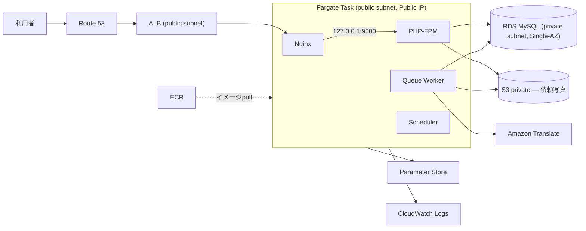

# Da Nang Help — 本番公開計画（RELEASE_PLAN）

**作成: 2026-10-02 — 対象: v0.1.0（MVP機能実装完了）からソフトローンチまで**

## 1. 本ドキュメントの位置づけ

- [`docs/BLUEPRINT.md`](BLUEPRINT.md)：要件・設計そのもの（何を作ったか）
- [`docs/BACKLOG.md`](BACKLOG.md)：何が残っているか（P0/P1/P2の一覧）
- **本ドキュメント（RELEASE_PLAN.md）**：BACKLOGのP0項目を**どの順番で・どう本番公開まで持っていくか**

v0.1.0タグ（commit `8223eb1`）はMVP機能実装完了のチェックポイントとして**動かしません**。本ドキュメントに沿った本番公開準備が完了した時点で、新規に`v0.1.1`タグを作成します。

## 2. 前提とスコープ

- 対象はダナンでの**限定エリア・限定カテゴリからのソフトローンチ**（[12 戦略的考察](BLUEPRINT.md#12-戦略的考察)のGo-to-market戦略）。全国・全カテゴリへの一般公開ではありません。
- 利用者・収益がまだ存在しない実験段階であるため、[10 非機能要件](BLUEPRINT.md#10-非機能要件)「コスト管理（Stage 1）」の方針（Multi-AZ・Auto Scaling・Redis・SQS・CloudFront・WAF・NAT Gatewayは不採用）を踏襲します。
- 本ドキュメントは**AWSインフラをまだ1つも作成していない**時点から書き始めています。

### 2.1 着手前提チェックリスト（フェーズB開始前に必須、「スコープ外」にしない）

AWSアカウントまわりの基礎設定は、曖昧に「前提条件」として済ませず、フェーズB着手前の明示的なゲートとして扱います。

- [ ] AWSアカウントのrootユーザーにMFAを設定済み
- [ ] 請求アラート（コンソールの基本的な請求通知。4.5節のAWS Budgetsとは別に、アカウント全体の異常検知として設定）
- [ ] IAM管理方針を決定済み（個人の長期アクセスキーを作らない。4.6節参照）
- [ ] 請求用の連絡先・支払い方法が有効

## 3. フェーズA — アプリ内P0対応（AWSインフラに依存しない）

AWSインフラの有無に関わらず着手できる項目です。インフラ構築（フェーズB）と並行して進められます。

| 項目 | 内容 | 完了条件（BACKLOG.mdより） |
|---|---|---|
| A-1 書き込み系エンドポイントのレート制限 | 登録・依頼投稿・Offer送信・写真アップロード等 | [BACKLOG.md P0-1](BACKLOG.md#p0-1-書き込み系エンドポイントのレート制限) |
| A-2 Amazon Translate実装 | `FakeTranslator`→本番実装への差し替え。AWSインフラ構築前でも疎通確認・実装・自動テストは可能。**IAM Identity Centerまたは一時認証情報（STSの一時クレデンシャル）を利用して先行検証する。長期アクセスキーを持つ開発用IAMユーザーは原則作成しない**（詳細は4.6節） | [BACKLOG.md P0-2](BACKLOG.md#p0-2-amazon-translate実装) |
| A-3 利用規約・プライバシーポリシー | en/ja/vi 3言語。**草案段階では専門家未レビューであることを本ドキュメント上で記録する。実ユーザーを受け入れるソフトローンチ前に、ベトナム法・個人情報の越境処理を含め、必要に応じて専門家の確認を受ける**（未レビューである旨を公開ポリシー本文へ表示する必要はない） | [BACKLOG.md P0-11](BACKLOG.md#p0-11-利用規約プライバシーポリシー) |

この3項目は、フェーズB（AWS基盤）の着手を待たずに先行して計画・実装を進めて構いません。

## 4. フェーズB — AWS基盤方針

### 4.1 確定事項（今回の合意）

| 論点 | 結論 |
|---|---|
| コンピュート方式 | **Fargate + ALBを維持**。EC2への切り替えは行わない |
| 理由 | EC2との差額（概算$5〜25/月）よりも、ECS/Fargate/ALBの実践学習の価値を優先。月額の差分で運用負荷（OSパッチ・Docker自前管理・障害復旧の自前実装）を引き受けるコストの方が大きいと判断 |
| 月額予算 | **通常目標 $80/月以内、上限 $100/月**（異常時含む）。**$80は努力目標であり、初期構築時（4コンテナを同一Taskで動かすため最初は1vCPU/2GBで検証する想定、4.4節参照）には一時的に超過し得る** |
| NAT Gateway | **Stage 1では不採用**（public subnet + Task Public IP + Security Groupで代替） |
| 常設ステージング環境 | **作らない**。検証が必要な時だけ一時的に構築し、終わったら削除してコストを抑える |
| インフラ作成前の必須ゲート | **AWS Pricing Calculatorによる最終見積もり**を取得し、下記4.4の月額目安と大きく乖離しないことを確認してから着手する |

### 4.2 構成（Stage 1）

[18 AWS構成案](BLUEPRINT.md#18-aws構成案)のStage 1方針をそのまま採用し、以下を基本構成とします。

- **ALB**: public subnet。本番Taskのポートのみへルーティング
- **Fargate Task**: public subnet + Public IP。Security GroupはALBからの通信のみ受信
- **RDS**: private subnet、Fargateからのみ接続許可
- **S3**: 依頼写真（private、object_key管理、署名付きURL）
- **ECR**: コンテナイメージ
- **Parameter Store**: 秘密情報（Standard tier）
- **CloudWatch**: ログ・監視
- **採用しないもの**: CloudFront、ElastiCache（Redis）、NAT Gateway、WAF、Multi-AZ、Auto Scaling

### 4.3 本番Taskの構成見直し（今回の確定事項）

現在のローカル開発用`docker-compose.yml`は`node`（フロントエンドビルド用）と`mailpit`（開発用メールキャッチャー）をサービスとして含んでいますが、**これらは本番Taskには含めません**。

| サービス | 開発環境 | 本番Task |
|---|---|---|
| Nginx | ✅ | ✅ |
| PHP-FPM | ✅ | ✅ |
| Queue Worker | ❌（手動実行） | ✅ 常駐 |
| Scheduler | ❌（手動実行） | ✅ 常駐 |
| Node (Vite) | ✅ 開発サーバー | ❌ — **CIのDockerビルド時にフロントをビルドし、`public/build/`の成果物だけを本番イメージへ含める**（マルチステージビルド） |
| MySQL | ✅（コンテナ） | ❌ — RDSを使用 |
| Mailpit | ✅ | ❌ — **Amazon SES等へ置換**（本番メール送信ドメイン認証はフェーズC） |

本番ランタイムは**Nginx・PHP-FPM・Queue Worker・Schedulerの4プロセス**で構成します。

**単一Task内4コンテナ vs Workerを別ECS Serviceに分離するか**については、[BLUEPRINT.md 18節](BLUEPRINT.md#ecs構成-単一task内の4コンテナv031で変更)の既存方針（コスト最優先のStage 1では単一Task・単一Serviceへ統合）をそのまま踏襲し、**単一Task内4コンテナ構成を採用**します。Worker分離は[BLUEPRINT.md「Stage 2以降へ先送りするもの」](BLUEPRINT.md#stage-1--stage-2-の境界)に既に明記されているStage 2移行トリガー（WebとWorkerがCPU/メモリを取り合うようになった等）が実際に発生してから検討します。新たな判断は不要です。

**可用性に関する明示的な割り切り**: ECS ServiceはStage 1では`desiredCount=1`とします。単一障害点であること、Task入れ替え（デプロイ・異常終了からの再起動）の間は短時間の停止が発生することを許容します。各コンテナ（Nginx・PHP-FPM・Worker・Scheduler）は`essential: true`とし、いずれか1つでも停止するとTask全体が再作成される既存のBLUEPRINT方針（低トラフィック期はこの再起動時の短時間欠落を許容し、複雑な障害分離は導入しない）を踏襲します。

**Nginx用イメージとPHP-FPM用イメージで、同一コミットのフロントエンド資産を確実に一致させる方法**: Nginxコンテナ（静的ファイルを配信）とPHP-FPMコンテナ（Viteのmanifest.jsonを参照してタグを生成）は別イメージ・別ファイルシステムのため、ビルド元のGit commitが食い違うと配信ファイルとHTMLが参照するファイル名が不一致を起こし得ます。これを避けるため、CI/CDパイプライン内で**フロントエンド資産（`public/build/`）を1回だけビルドし、同一のビルド成果物をNginxイメージ・PHP-FPMイメージ双方のビルドコンテキストへコピーしてから、両イメージに同じGit commit SHAタグを付けて同時にpushする**（詳細はC-1）。

**現状のDockerビルド基盤**: `docker/php/Dockerfile`には`dev`ターゲット（ローカル開発用）に加え、本番ECRイメージを見据えた`build`ターゲット（`composer install --no-dev`、autoload最適化）が既に用意されています。ただし以下は未実装です。

- フロントエンド資産（Vite）のビルドをこのDockerfileのマルチステージに統合すること
- `docker/nginx/default.conf`を単一Fargate Task向け（`fastcgi_pass 127.0.0.1:9000`、現在は`php:9000`というdocker-compose内のサービス名を使用）に調整すること
- 最終的な軽量ランタイムステージ（開発ツール・composer.lock等を含まない）の追加

これらはフェーズCで実装します。

### 4.4 コスト試算（Singapore/ap-southeast-1、概算）

AWS Pricing Calculatorでの最終確認を前提とした、計画時点の目安です。**4コンテナ（Nginx・PHP-FPM・Worker・Scheduler）を同一Task内で動かすため、初回構築時はまず1vCPU/2GBで検証し、実測後に0.5vCPU/1GBへ縮小できるか判断するのが安全です**（先に縮小構成だけを前提にしない）。

| 項目 | 月額目安 | 備考 |
|---|---|---|
| ALB（基本料金+LCU+**Public IPv4料金**） | 〜$20〜25 | ALBの固定時間課金・LCU従量に加え、Public IPv4アドレスへの時間課金が別途発生する点に注意 |
| RDS db.t4g.micro（Single-AZ、MySQL） | 〜$18〜20 | ストレージ込み概算。**T4g/T3は無料CPUクレジットのベースラインを超えると追加のCPUクレジット課金が発生**するため、継続的に高負荷が続く場合は想定より増額し得る |
| S3・ECR・Route 53・CloudWatch Logs・データ転送・**Fargate TaskのPublic IPv4** | 〜$5〜10 | いずれも少額だが個別に発生。Fargate Taskも（ALBと同様に）Public IPを持つため、ALB分とは別にTask側のPublic IPv4課金が発生する点に注意 |
| Amazon Translate・SES | 〜$1〜6 | 低トラフィックのソフトローンチ初期は少額想定。Translateの文字数上限・レート制限はA-2で設計 |
| NAT Gateway | $0 | **不採用のため課金なし**（採用した場合は基本料金だけで月額約$32.40、データ処理料金が別途加算されるため、Stage 1では明確に不採用とする根拠とする） |

| Fargateのサイズ | Fargate月額目安 | 上記合計との総計 |
|---|---|---|
| **1vCPU/2GB（初回構築・検証時はこちらを前提）** | 〜$43 | **約$87〜104/月** |
| 0.5vCPU/1GB（実測後、縮小できると判断した場合） | 〜$22 | **約$66〜83/月** |

上限$100/月に対し、1vCPU/2GBでの初回構築時点では既にほぼ上限付近（最大$104）となり得ます。**実測後、速やかに0.5vCPU/1GBへ縮小できるか検証し、$80/月の通常目標内へ収める**ことを初期運用のタスクとして扱ってください（D-2のモニタリングと合わせて実施）。

### 4.5 AWS Budgets通知設定

| しきい値 | 意味 |
|---|---|
| $50 | 早期確認（想定の半分を超えた時点で傾向を把握） |
| $80 | 通常目標超過（原因調査を開始） |
| $100 | 即時調査（上限到達、緊急対応） |

AWS Budgetsは支出を自動停止する仕組みではなく通知のみである点は[BLUEPRINT.md](BLUEPRINT.md#amazon-translateの費用制御)に明記済みの前提を踏襲します。

### 4.6 フェーズBの作業項目

1. AWS Pricing Calculatorで4.4の試算を検証（**インフラ作成の必須ゲート**、1vCPU/2GB想定で$100/月を明確に超える場合は着手前に構成を見直す）
2. AWS Budgets通知の設定（4.5）
3. インフラはTerraform等のIaCで管理する（手動コンソール操作に頼らず、7節の一時検証環境を確実に作成・削除できるようにするため）。あわせて以下を決定する:
   - Terraform stateの保存場所（例: S3バックエンド）・暗号化・排他制御（state lock）
   - staging（7節の一時検証環境）とproductionでstateを分離する（同一stateを使い回さない）
   - DBパスワード・`APP_KEY`等の秘密値は、Terraformコード・変数ファイル・**state**のいずれにも平文で残さない。Parameter StoreのSecureStringをTerraformで「作成」しても、投入した値自体がstateに残り得る点に注意し、**値の投入（書き込み）はTerraform経由で行わず**、CIのsecret機能、または管理者による安全な初期登録手順（D-3と同様の運用）として別途定義する
4. VPC・サブネットの作成。**AZ要件に注意**:
   - ALBには異なるAZのpublic subnetが最低2つ必要
   - RDS DB Subnet GroupにはSingle-AZ配置であっても、異なるAZのsubnetを最低2つ登録する必要がある（「Single-AZだからsubnetも1つ」ではない）
   - 推奨構成: **2 public subnet + 2 private subnet**
5. Security Groupの作成（ALB→Fargate Task、Fargate Task→RDSのみを許可）
6. IAMロールを用途別に分離して作成（最小権限）:
   - **Task Execution Role**: ECRからのイメージpull、CloudWatch Logsへの出力、起動時のParameter Storeからのsecret取得
   - **Task Role**: 実行中のアプリケーションコードが使うS3・Amazon Translateへのアクセス
7. ECRリポジトリの作成（lifecycle policyで世代数を制限し、無期限蓄積を防ぐ。ただし直近の安定世代へすぐ切り戻せる本数は残す、8節参照）
8. RDS for MySQL（Single-AZ、private subnet、4で作成したDB Subnet Group使用）の作成
9. S3バケット（private）の作成。lifecycle policyは対象を限定して設定する（依頼写真に単純な日数ベースの保持期間を設定すると、利用中の写真が自動削除される恐れがあるため）:
   - 依頼に紐づく**利用中の写真**: 日数では削除しない。`request_photos`のDB行削除に連動してアプリケーション側がオブジェクトを削除する運用のみとし、S3 lifecycleでの自動削除対象には含めない
   - **incomplete multipart upload**: 一定日数後にlifecycle policyで自動削除
   - バージョニングを使う場合の**noncurrent version**: 保持期間を決めてlifecycle policyで削除
   - **一時ファイル**: 専用prefix（例: `tmp/`）へ分離し、そのprefixのみ期限削除の対象とする
10. Parameter Store（Standard）への秘密情報登録（BACKLOG P0-5）。DBパスワード・`APP_KEY`等はSecureStringとして保存する
11. ACM証明書の発行とDNS検証（Route 53でのCNAMEレコード追加）
12. ALBの作成（public subnet、ACM証明書をHTTPSリスナーへ紐付け）
13. Route 53 Hosted Zoneとドメインの紐付け
14. CloudWatch Logsのロググループにretention期間を設定（無期限保存を避ける）

## 5. フェーズC — デプロイ機構

フェーズBのインフラを前提に、実際にアプリケーションをデプロイできる状態にします。

| 項目 | 内容 | 関連BACKLOG |
|---|---|---|
| C-1 本番Dockerイメージの確立 | 4.3節のマルチステージビルド（Vite資産ビルド→Nginx・PHP-FPM双方へ同一成果物をコピー→軽量ランタイム）を`docker/php/Dockerfile`・`docker/nginx/default.conf`へ実装。両イメージとも同一Git commit SHAタグでpush | — |
| C-2 CI/CD | push/PR時にPHPUnit・Vitest・`tsc --noEmit`・lintを自動実行。mainマージ時のデプロイパイプライン全体の実行順序は下記5.1 | [BACKLOG P0-4](BACKLOG.md#p0-4-cicd) |
| C-3 DBマイグレーション手順 | デプロイパイプラインの一部として実行する（migrationの位置づけは下記5.1のステップ5〜6）。one-off task・失敗時の扱い・同時実行防止・Seederとの分離の詳細も5.1に記載 | — |
| C-4 Worker/Scheduler常駐設定 | 同一Task内でqueue:work・schedule:workを独立プロセスとして起動し、異常終了時のTask全体再起動を許容する運用（[BLUEPRINT.md](BLUEPRINT.md#ecs構成-単一task内の4コンテナv031で変更)方針どおり） | [BACKLOG P0-6](BACKLOG.md#p0-6-本番キューworkerとschedulerの常駐設定) |
| C-5 Storage署名付きURL・CORS | S3バケットのCORS設定、`temporaryUrl()`が本番でも正しく機能することを確認 | [BACKLOG P0-7](BACKLOG.md#p0-7-storageの公開署名付きurlcors設定) |
| C-6 メール送信ドメイン認証 | SES設定、SPF/DKIM/DMARC、Mailpitからの切替 | [BACKLOG P0-8](BACKLOG.md#p0-8-メール送信ドメインの認証) |
| C-7 queue_jobsテーブル名の衝突について | [BLUEPRINT.md](BLUEPRINT.md#18-aws構成案)の既存方針どおり、キューはLaravel既定の`jobs`テーブルのまま、ドメイン側は既に`service_jobs`へ改名済み（追加対応不要） | — |

### 5.1 デプロイパイプラインの実行順序（C-2・C-3）

**「Task Definitionの更新」と「トラフィック切り替え」を明確に分離する**ため、mainマージ時のパイプラインは以下の順序で実行します。

1. テスト（PHPUnit・Vitest・`tsc --noEmit`・lint）
2. Dockerビルド（4.3節のマルチステージビルド。Nginx・PHP-FPM双方のイメージを同一のフロントエンド資産から作成）
3. **commit SHAの不変タグ**でECRへpush（`latest`タグも合わせて更新するが、ロールバック時に参照するのは常にSHAタグ。8節参照）
4. 新しいECS Task Definitionを登録する（**この時点ではまだ稼働中のServiceへは反映しない**）
5. 4で登録した新Task Definitionを使って、**migration one-off task**（`aws ecs run-task`、常駐Serviceとは別の一時起動）として`php artisan migrate --force`を実行する
6. migrationの成功を待機する。**失敗した場合はここでパイプラインを中断し、以降のステップへ進まない**（Task Definitionは4で登録済みだが、ECS Serviceは古いTask Definitionのまま稼働を継続している — 「登録」と「切り替え」を分けているため、失敗時に何も壊れていない）
7. migrationが成功した場合のみ、ECS Serviceを新Task Definitionへ更新する（ここで初めて新しいコンテナが起動し、トラフィック切り替えが始まる）
8. ALBのヘルスチェック成功（新Taskが正常応答すること）を確認する
9. 8で失敗した場合は、ECSのデプロイ設定（最小健全率・最大率）に従って**旧Service（旧Task Definition）を維持**し、新Taskへは切り替えない

**同時実行防止**: 上記パイプライン自体をCI側でジョブ直列化し、2つのデプロイが同時に走らないようにする（Laravel標準の`migrate`コマンド自体に排他制御はないため、パイプライン側で担保する）。

**SeederとMigrationの分離**: 本番パイプラインが自動実行するのはステップ5の`migrate --force`のみ。Seeder（`CategorySeeder`等）は別のone-off taskとして、必要な時だけ手動トリガーで実行する（D-4「本番SeederでDemoデータを作成しないことの確認」と合わせて、自動実行対象から明確に分離する）。

**後方互換性の前提**: ステップ5〜7の間、旧Task（旧コード）と新しく適用されたDBスキーマが一瞬共存するため、マイグレーションは後方互換性のある変更であることを前提とします（詳細は8節のexpand/contract方針を参照）。

## 6. フェーズD — 運用確認

フェーズCまでで実際に動いているインフラ上で検証する項目です。

| 項目 | 内容 | 関連BACKLOG |
|---|---|---|
| D-1 DBバックアップ・復元テスト | RDS自動バックアップの有効化、実際のスナップショット復元を1回検証 | [BACKLOG P0-9](BACKLOG.md#p0-9-データベースバックアップと復元テスト) |
| D-2 エラー監視・ヘルスチェック・アラート | CloudWatchへの致命的エラー集約。ヘルスチェックは**`/health`（軽量な生存確認、プロセスが応答するかのみ）とDB接続確認を含む別経路（深いヘルスチェック）を分ける**。ALBのヘルスチェックには前者（`/health`）を使い、DB障害時にALBがTask自体を不健全と誤判定して無限に再起動を繰り返す事態を避ける | [BACKLOG P0-10](BACKLOG.md#p0-10-エラー監視ヘルスチェックアラート) |
| D-3 Admin初期作成手順 | パスワードをリポジトリ・ログへ残さない本番Admin作成手順の文書化・実施 | [BACKLOG P0-12](BACKLOG.md#p0-12-管理者アカウントの安全な初期作成手順) |
| D-4 本番Seeder確認 | 本番デプロイ時に`CategorySeeder`等の必須マスタのみ実行され、Demo Provider等が作成されないことを確認 | [BACKLOG P0-13](BACKLOG.md#p0-13-本番seederでdemoデータを作成しないことの確認) |
| D-5 README・運用手順 | フェーズA〜Dすべてが固まった後に、正確な内容で作成 | [BACKLOG P0-14](BACKLOG.md#p0-14-readme運用手順) |

## 7. ステージング公開と最終確認チェックリスト

常設のステージング環境は作らず、**このフェーズの検証時だけ一時的に本番相当環境を構築**し、検証完了後は削除します（4.1節の確定事項）。

確認項目：

- [ ] 実際のAmazon Translateで翻訳が機能する（FakeTranslatorではない）
- [ ] 実際のSES経由でメールが届く（Mailpitではない）
- [ ] S3への写真アップロード・署名付きURLでの表示が機能する
- [ ] Queue Worker・Schedulerが本番相当環境で正しく常駐・自動確定バッチが動作する
- [ ] Customer／Provider／Adminの権限制御が本番相当環境でも機能する（モデレーション非表示・private fields等）
- [ ] モバイル表示（PC/モバイル双方）でレイアウト崩れ・Consoleエラーがない
- [ ] 書き込み系エンドポイントのレート制限が機能する
- [ ] 本番ドメインでのTLS証明書（ACM）が有効
- [ ] AWS Budgetsのアラートが実際に通知される設定になっている
- [ ] 一時構築した検証環境を確認後に削除し、課金が残らないことを確認

## 8. ロールバック手順

本番の`migrate:rollback`を基本手段にはしません。`down()`の実行でデータが失われる可能性があり、障害対応中に追加のデータ損失を招くリスクがあるためです。

### 8.1 基本方針

1. **アプリケーションのロールバック（第一手段）**: ECSのTask定義を**直前のGit commit SHAタグ付きイメージ**へ戻す。C-2により`latest`に加えて各ビルドがcommit SHAの不変タグでECRへpushされているため、特定のコミット単位で確実に切り戻せる
2. **DBスキーマ変更は原則として後方互換マイグレーション＋forward fixで対応する**: 新しいコードが前のDBスキーマでも、前のコードが新しいDBスキーマでも、どちらでも動作する状態を維持しながら進める（expand/contract方式）。問題が見つかった場合は`down()`で巻き戻すのではなく、**前進方向の修正（forward fix）を新しいマイグレーション・新しいデプロイとして適用する**
3. **破壊的なスキーマ変更（カラム削除・型変更等）は、expand/contract方式で複数リリースに分割する**: 例）(1)新カラムを追加しつつ旧カラムも残す→(2)アプリケーションを新カラム参照へ切り替える→(3)旧カラムが不要になったことを確認した別リリースで削除する、という順序を踏み、1回のデプロイで破壊的変更とアプリ切り替えを同時に行わない
4. **`migrate:rollback`は、内容を個別に確認した場合に限り、最終手段の一つとして使用可**（実行前に必ずバックアップ（D-1）を取得する）
5. **スナップショット復元は重大障害時の最終手段**とし、直近のRDS自動バックアップ（D-1で検証済み）からの復元を行う。これは他のすべての手段で対応できない場合にのみ用いる

### 8.2 手順

Stage 1は単一環境構成（常設のステージング・旧環境は存在しない）のため、「Route 53を旧環境へ向ける」という切り戻し手段は**実行不能**です。以下の現実的な手段を使います。

1. **第一手段**: ECS Serviceを**旧Task Definition**（直前の安定リビジョン）へ切り戻す（8.1-1と同じ、これが基本）
2. **サービス停止が必要な場合**（例: データ破損が疑われ、即座に書き込みを止める必要がある）: ALBリスナールールの**固定レスポンス（fixed response）**を返す設定に切り替えるか、事前に用意したメンテナンス表示用の軽量Taskへルーティング先を切り替える
3. **DNSレベルの切り替え**: 別環境（他のリージョン・他のスタック等）が実在する場合にのみ使う補助的な手段であり、Stage 1の標準手順には含めない
4. 上記の優先順位（アプリロールバック→forward fix→個別確認の上でのrollback→スナップショット復元、8.1節）に従って対応する
5. ロールバック実施後は、原因調査が完了し再発防止策が講じられるまで再デプロイしない

## 9. v0.1.1タグ付けとソフトローンチ移行基準

フェーズA〜Dおよび7節のチェックリストがすべて完了した時点で、以下の順序で進めます（v0.1.0タグ作成時と同様の手順）。

1. 本ドキュメント・BACKLOG.mdの更新（完了した項目の反映）
2. ドキュメント更新のレビュー・コミット・push
3. 7節の最終確認チェックリストを実施
4. working treeがclean、HEADがorigin/mainと一致していることを確認
5. `git tag -a v0.1.1 -m "<内容を要約したメッセージ>"`で注釈付きタグを作成
6. タグのpushは別途明示的な確認を得てから実行

ソフトローンチ移行（実際のユーザーへの告知・限定エリア/カテゴリでの受付開始）は、本ドキュメントのスコープ外とし、別途マーケティング・運営側の判断で決定します。
